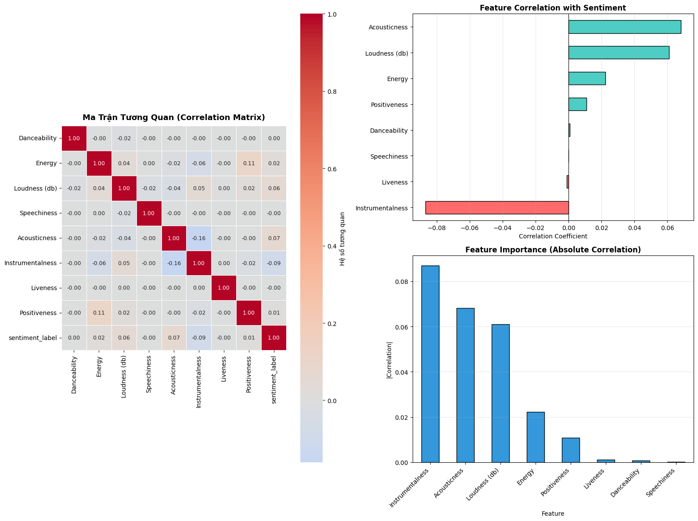
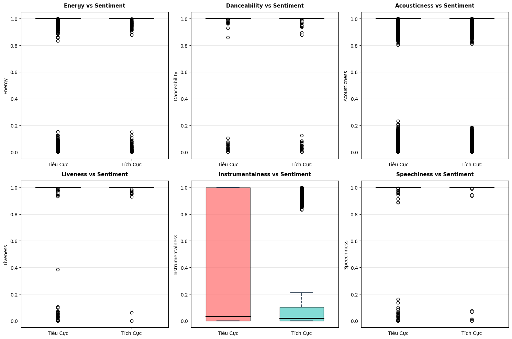
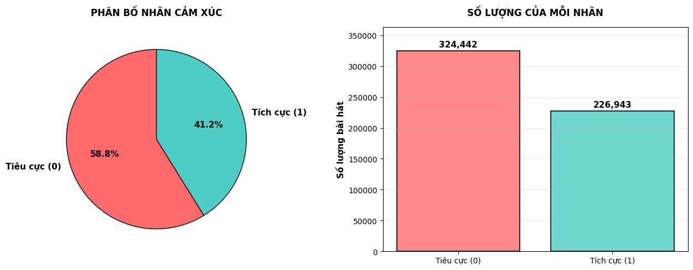
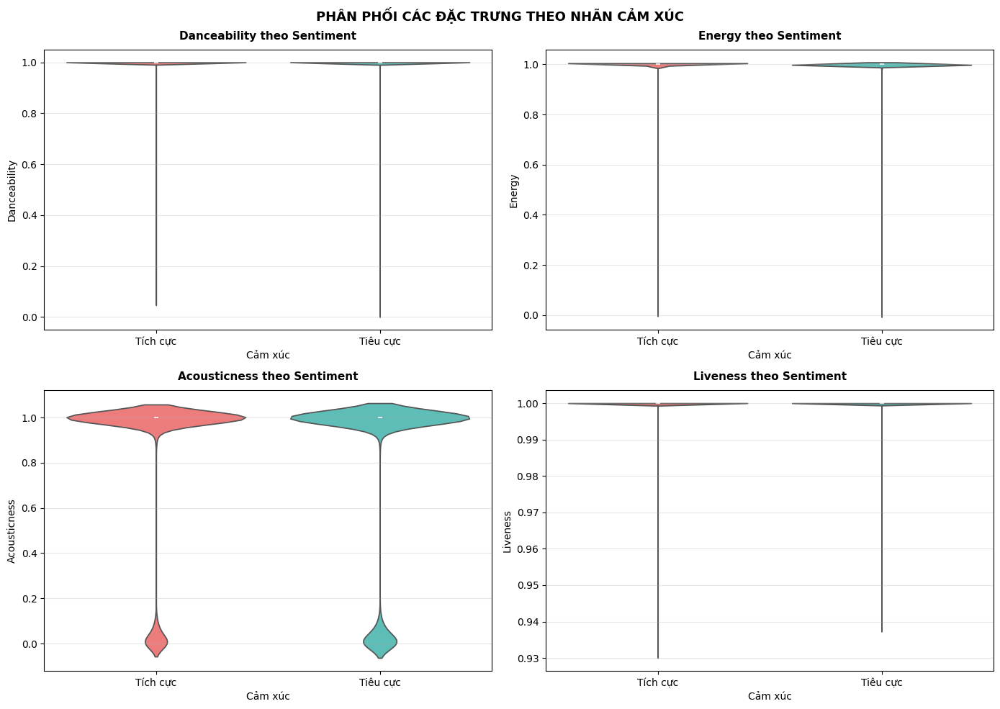
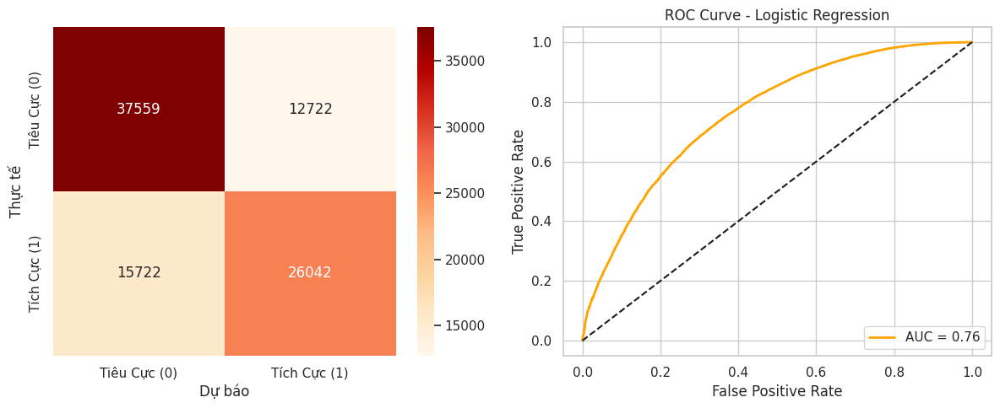
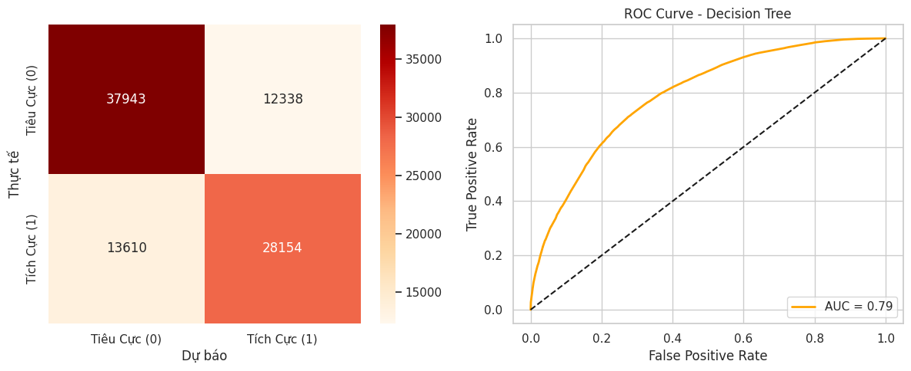
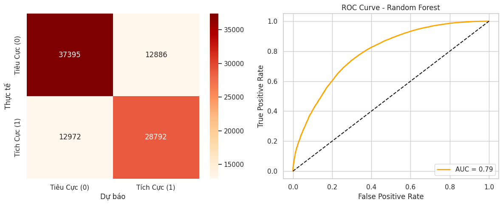
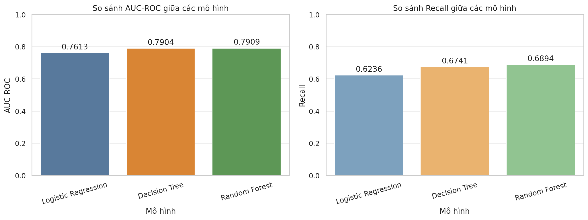

```python
import findspark
# findspark sẽ tự động tìm thư mục spark-3.5.8-bin-hadoop3 dựa vào biến môi trường SPARK_HOME bạn vừa cài
findspark.init()

from pyspark.sql import SparkSession

# Khởi tạo Spark Session
spark = SparkSession.builder \
    .appName("Test_Spark_Spotify") \
    .master("local[*]") \
    .getOrCreate()

print("Đã khởi tạo Spark thành công! Phiên bản:", spark.version)

# Đọc thử file dataset của bạn
df = spark.read.csv("spotify_dataset.csv", header=True, inferSchema=True)
df.show(5)
```

    26/05/29 01:04:43 WARN Utils: Your hostname, ubuntu resolves to a loopback address: 127.0.1.1; using 10.0.2.15 instead (on interface enp0s3)
    26/05/29 01:04:43 WARN Utils: Set SPARK_LOCAL_IP if you need to bind to another address
    Setting default log level to "WARN".
    To adjust logging level use sc.setLogLevel(newLevel). For SparkR, use setLogLevel(newLevel).
    26/05/29 01:04:44 WARN NativeCodeLoader: Unable to load native-hadoop library for your platform... using builtin-java classes where applicable


    Đã khởi tạo Spark thành công! Phiên bản: 3.5.8


    26/05/29 01:05:01 WARN SparkStringUtils: Truncated the string representation of a plan since it was too large. This behavior can be adjusted by setting 'spark.sql.debug.maxToStringFields'.


    +---------+--------------------+--------------------+--------------------+--------------------+--------------------+--------------------+--------------------+--------------------+-------+-------------+--------------+---------------+----------+------+--------------------+--------------------+--------------------+--------------------+--------------------+----------------+--------------+-------------------+------------------------------+-----------------+----------------+------------------------+----------------+--------------------------+------------------------+----------------+--------------------+------------------+----------------+----------------+------------------+--------------------+------------------+------------------+
    |Artist(s)|                song|                text|              Length|             emotion|               Genre|               Album|        Release Date|                 Key|  Tempo|Loudness (db)|Time signature|       Explicit|Popularity|Energy|        Danceability|        Positiveness|         Speechiness|            Liveness|        Acousticness|Instrumentalness|Good for Party|Good for Work/Study|Good for Relaxation/Meditation|Good for Exercise|Good for Running|Good for Yoga/Stretching|Good for Driving|Good for Social Gatherings|Good for Morning Routine|Similar Artist 1|      Similar Song 1|Similarity Score 1|Similar Artist 2|  Similar Song 2|Similarity Score 2|    Similar Artist 3|    Similar Song 3|Similarity Score 3|
    +---------+--------------------+--------------------+--------------------+--------------------+--------------------+--------------------+--------------------+--------------------+-------+-------------+--------------+---------------+----------+------+--------------------+--------------------+--------------------+--------------------+--------------------+----------------+--------------+-------------------+------------------------------+-----------------+----------------+------------------------+----------------+--------------------------+------------------------+----------------+--------------------+------------------+----------------+----------------+------------------+--------------------+------------------+------------------+
    |      !!!|Even When the Wat...|"Friends told her...| you won't know w...| friends told her...| she doesn't reme...| she sees clearly...| and he never cal...|               03:47|sadness|      hip hop|      Thr!!!er|29th April 2013|     D min|   105|             -6.85db|                 4/4|                  No|                  40|                  83|              71|            87|                  4|                            16|               11|               0|                       0|               0|                         0|                       0|               0|                   0|                 0|               0|               0|       Corey Smith|If I Could Do It ...|0.9860607848219312|        Toby Keith|
    |      !!!|  One Girl / One Boy|Well I heard it, ...|               04:03|             sadness|             hip hop|            Thr!!!er|     29th April 2013|              A# min|    117|      -5.75db|           4/4|             No|        42|    85|                  70|                  87|                   4|                  32|                   0|               0|             0|                  0|                             0|                0|               0|                       0|               0|                         0|                       0| Hiroyuki Sawano|        BRE@TH//LESS|0.9954090051457943|    When In Rome|    Heaven Knows|0.9909052446506661|        Justice Crew|         Everybody|0.9844825577360079|
    |      !!!|   Pardon My Freedom|Oh my god, did I ...|               05:51|                 joy|             hip hop|       Louden Up Now|       8th June 2004|               A Maj|    121|      -6.06db|           4/4|             No|        29|    89|                  71|                  63|                   8|                  64|                   0|              20|             0|                  0|                             0|                1|               0|                       0|               0|                         0|                       0|   Ricky Dillard|More Abundantly M...|0.9931760848028455|          Juliet|          Avalon|0.9651469454636374|        The Jacksons|        Lovely One|0.9567517825366731|
    |      !!!|                 Ooo|"[Verse 1] Rememb...| it's just you an...| girl? Shouldn't ...| girl?  [Verse 2]...| did I forget to ...| girl? Shouldn't ...| girl?  [Bridge] ...|   ever|         ever|     ever Ever|           ever|      ever|  ever| ever  [Chorus] S...| girl? (Should we...| girl? (Should we...| ever and ever (F...| ever Don't you t...|           03:44|           joy|            hip hop|                         As If|16th October 2015|           A min|                     122|         -5.42db|                       4/4|                      No|              24|                  84|                78|              97|               4|                12|                  12|                 0|                 0|
    |      !!!|          Freedom 15|[Verse 1] Calling...|               06:00|                 joy|             hip hop|               As If|   16th October 2015|               F min|    123|      -5.57db|           4/4|             No|        30|    71|                  77|                  70|                   7|                  10|                   4|               1|             0|                  0|                             0|                1|               0|                       0|               0|                         0|                       0|      Cibo Matto|        Lint Of Love|0.9816095587586925| Barrington Levy|Better Than Gold|0.9815243376825868|           Freestyle|     Its Automatic|0.9814147734456016|
    +---------+--------------------+--------------------+--------------------+--------------------+--------------------+--------------------+--------------------+--------------------+-------+-------------+--------------+---------------+----------+------+--------------------+--------------------+--------------------+--------------------+--------------------+----------------+--------------+-------------------+------------------------------+-----------------+----------------+------------------------+----------------+--------------------------+------------------------+----------------+--------------------+------------------+----------------+----------------+------------------+--------------------+------------------+------------------+
    only showing top 5 rows
    


```python
# BÀI TẬP LỚN: BIG DATA SENTIMENT ANALYSIS ON SPOTIFY SONGS
## Học phần: Cơ sở dữ liệu lớn (Big Data)
### 1. Chuẩn bị dữ liệu (Data Collection)
##Nguồn dữ liệu**: Kho mở Kaggle (Bộ dữ liệu 900k bài hát Spotify).
##Mục tiêu đề tài**: Phân tích cảm xúc (Sentiment) của bài hát dựa trên các thuộc tính âm thanh (Audio Features) như `valence` (độ tích cực), `energy` (năng lượng), `danceability` (độ sôi động) để phân loại bài hát mang cảm xúc Tích cực (Positive) hay Tiêu cực (Negative).
```


```python
##KHỞI TẠO SPARK SESSION
import findspark
findspark.init()

from pyspark.sql import SparkSession
from pyspark.sql.functions import col, when, count

# Khởi tạo Spark Session cấu hình tối ưu cho dữ liệu lớn
spark = SparkSession.builder \
    .appName("Spotify_Sentiment_Analysis") \
    .master("local[*]") \
    .config("spark.driver.memory", "4g") \
    .config("spark.executor.memory", "4g") \
    .getOrCreate()

print("Spark Session đã sẵn sàng. Phiên bản:", spark.version)
```

    Spark Session đã sẵn sàng. Phiên bản: 3.5.8


    26/05/29 01:05:05 WARN SparkSession: Using an existing Spark session; only runtime SQL configurations will take effect.


```python
### 2. Tiền xử lý & Lưu trữ dữ liệu lớn (HDFS / Parquet)
##Lý do cần làm sạch dữ liệu**: Bộ dữ liệu lớn thường chứa các giá trị trống (Null/NaN), dữ liệu trùng lặp hoặc các bản ghi lỗi do quá trình thu thập. Nếu không làm sạch, mô hình Học máy sẽ bị nhiễu, làm giảm độ chính xác và gây lỗi tính toán phân tán.
##Chiến lược xử lý: 
  ##1. Loại bỏ các dòng bị thiếu thông tin ở các cột tính năng cốt lõi.
  ##2. Gán nhãn cảm xúc (`sentiment_label`): Dựa vào chỉ số `valence` (từ 0.0 đến 1.0). Nếu `valence >= 0.5` -> Cảm xúc Tích cực (1.0), ngược lại -> Tiêu cực (0.0).
  ##3. Lưu trữ dưới dạng định dạng nén **Parquet** lên HDFS để tối ưu hóa tốc độ đọc/ghi theo cột (Columnar Storage) thay vì lưu file CSV thô.
```


```python
### 2.1 TRƯỚC LÀM SẠCH DỮ LIỆU - Kiểm Tra Giá Trị Null (THUẦN PYSPARK)
from pyspark.sql.functions import col, count, when

print('='*80)
print('KIỂM TRA GIÁ TRỊ NULL - TRƯỚC LÀM SẠCH')
print('='*80)

# 1. Tính tổng số hàng và cột bằng Spark (Thay cho len() của Pandas)
total_rows = df.count()
total_cols = len(df.columns)

# 2. Đếm số lượng NULL trên từng cột bằng Spark (Quét song song trên cụm, không kéo về RAM)
print('⏳ Đang quét kiểm tra dữ liệu song song trên các phân vùng...')
null_exprs = [count(when(col(c).isNull() | (col(c) == "NaN"), c)).alias(c) for c in df.columns]
null_counts_row = df.select(null_exprs).collect()[0]

# Tính tổng số lượng NULL trong toàn bộ dataset
total_nulls = sum(null_counts_row[c] for c in df.columns)

print(f'\n📊 Tổng số giá trị NULL trong dataset: {total_nulls:,}')
print(f'Tổng số hàng: {total_rows:,}')
print(f'Tổng số cột: {total_cols}')

print('\n📋 Số NULL từng cột:')
for col_name in df.columns:
    count_null = null_counts_row[col_name]
    if count_null > 0:
        pct = (count_null / total_rows) * 100
        print(f'  {col_name:25} -> {count_null:,} NULL ({pct:.2f}%)')

print('\n🔍 5 DÒNG ĐẦU CÓ GIÁ TRỊ NULL:')
# Tạo điều kiện lọc: Nếu bất kỳ cột nào có giá trị Null
condition = None
for c in df.columns:
    if condition is None:
        condition = col(c).isNull()
    else:
        condition = condition | col(c).isNull()

null_df = df.filter(condition)

# Kiểm tra xem có dòng nào chứa dữ liệu Null hay không
if null_df.count() > 0:
    # Chỉ lấy đúng 5 dòng đầu chuyển sang Pandas để IN RA ĐẸP MẮT (Lấy 5 dòng thì cực kỳ an toàn cho RAM)
    print(null_df.limit(5).toPandas().to_string())
else:
    print('Không có hàng nào chứa NULL')
```

    ================================================================================
    KIỂM TRA GIÁ TRỊ NULL - TRƯỚC LÀM SẠCH
    ================================================================================


                                                                                    

    ⏳ Đang quét kiểm tra dữ liệu song song trên các phân vùng...


                                                                                    

    
    📊 Tổng số giá trị NULL trong dataset: 100
    Tổng số hàng: 551,443
    Tổng số cột: 39
    
    📋 Số NULL từng cột:
      Length                    -> 4 NULL (0.00%)
      emotion                   -> 2 NULL (0.00%)
      Genre                     -> 3 NULL (0.00%)
      Album                     -> 23 NULL (0.00%)
      Release Date              -> 1 NULL (0.00%)
      Key                       -> 3 NULL (0.00%)
      Tempo                     -> 2 NULL (0.00%)
      Loudness (db)             -> 3 NULL (0.00%)
      Time signature            -> 8 NULL (0.00%)
      Explicit                  -> 1 NULL (0.00%)
      Popularity                -> 2 NULL (0.00%)
      Energy                    -> 1 NULL (0.00%)
      Danceability              -> 1 NULL (0.00%)
      Positiveness              -> 2 NULL (0.00%)
      Speechiness               -> 3 NULL (0.00%)
      Liveness                  -> 3 NULL (0.00%)
      Acousticness              -> 2 NULL (0.00%)
      Instrumentalness          -> 1 NULL (0.00%)
      Good for Party            -> 2 NULL (0.00%)
      Good for Work/Study       -> 2 NULL (0.00%)
      Good for Relaxation/Meditation -> 2 NULL (0.00%)
      Good for Exercise         -> 1 NULL (0.00%)
      Good for Running          -> 1 NULL (0.00%)
      Good for Yoga/Stretching  -> 2 NULL (0.00%)
      Good for Driving          -> 2 NULL (0.00%)
      Good for Social Gatherings -> 3 NULL (0.00%)
      Good for Morning Routine  -> 1 NULL (0.00%)
      Similar Artist 1          -> 2 NULL (0.00%)
      Similar Song 1            -> 1 NULL (0.00%)
      Similarity Score 1        -> 2 NULL (0.00%)
      Similar Artist 2          -> 1 NULL (0.00%)
      Similar Song 2            -> 2 NULL (0.00%)
      Similarity Score 2        -> 3 NULL (0.00%)
      Similar Artist 3          -> 2 NULL (0.00%)
      Similar Song 3            -> 3 NULL (0.00%)
      Similarity Score 3        -> 3 NULL (0.00%)
    
    🔍 5 DÒNG ĐẦU CÓ GIÁ TRỊ NULL:


                                                                                    

                     Artist(s)                    song                                                                                                                                                                                                                                                                                                                                                                                                                                                                                                                                                                                                                                                                                                                                                                                                                                                                                                                                                                                                                                                                                                                                                                                                                                                                                                                                                                                                                                                                                                                                                                                                                                                                                                                                                                                                                                                                                                                                                                                                                                                                                                                                                                                                                                                            text                                                                                                Length                                                                                                                                                                                                                                                                                                                                                         emotion                                                                                                                                              Genre                                                                                                                         Album                                               Release Date                                                                                                                     Key                                                                          Tempo                                                                                                                                                                                                                                                                                                                                        Loudness (db)                                                               Time signature                                                                                                             Explicit                                                      Popularity                                                                                                              Energy                                                  Danceability                                     Positiveness                                                                                   Speechiness                     Liveness                                                         Acousticness                                          Instrumentalness                                                                                                                                                                                                              Good for Party                                                                                                                                                                                 Good for Work/Study                                                                     Good for Relaxation/Meditation                                            Good for Exercise                                                                                                                                                                                                                                                                                                                                                                                                                                                        Good for Running                                                                                     Good for Yoga/Stretching                                                                                                         Good for Driving                                                                                           Good for Social Gatherings                                                                           Good for Morning Routine Similar Artist 1                                                                                                                                                                                                Similar Song 1                                                             Similarity Score 1                                                                    Similar Artist 2      Similar Song 2      Similarity Score 2          Similar Artist 3                                                Similar Song 3              Similarity Score 3
    0        Allday,Gracelands              Codeine 17                                                                                                                                                                                                                                                                                                                                                                                                                                                                                                                                                                                                                                                                                                                                                                                                                                                                                                                                                                                                                                                                                                                                                                                                                                                                                                                                                                                                                                                                                                                                                                                                                                                                                                                                                                                                                                                                                                                                                                  "[Verse 1: Allday] Back in Blackwood, I drove them pizzas Shout out to Sam, if you're there, go to Caesar's Hacked my girlfriend's Facebook, that hoe ass cheated Still, I cried down the phone, like, ""You know I need ya"" I'll save two thousand bucks and change my address Do some drugs   become a famous rapper Blow up and solve your problems that's misconception I just miss the honesty                                                                                                                                                                                                                                                                                                                                            don't miss rejection   no  [Verse 2: Allday & Nelson Dialect] Yeah she moved to Melbourne to fuck lil gremlin Who am I to not fuck that girl then? Lyrics for ourselves                                                                                        no-one else then Freestyles in the car                                              me and Nelson                                     like Quoting Big L on the way to Reynella to battle anybody Never pursuing the loot                                              look up to guru A moment of truth   like one day I'll do music too Now I'm responsible for my happiness But I'm irresponsible at times You don't know how to drive 'Til you hit obstacles skid off and survive Mum used to say we're like the Brady Bunch But there's way too much pill-popping and wine These memories just won't cross at the lights They stay jaywalking on my mind   when you say [Chorus: Gracelands] You say it's your time Codeine seventeen   eighteen won't die Nineteen came and went and it was all worthwhile If we only feel this way for one more night Ay                                                              ay                                                                                                                  ay                                             one more night Ay                                               ay                                                                                            ay            one more night Ay                                                                   ay                                                        ay   one more night If we only feel this way for one more night  [Verse 3: Allday] Rep the same ones that's tatted on me The classic nights we had with tragic money Said we'll die exploring before we settle Some drift away   you know it's continental We feared it changing now we feel it changing And I hate that resignation like this shit is fated I know time is money and we spend it wasted Then it's over in a blink                                                                                              blink   indication Usually I'm tongue sucking high Or stuck inside   too depressed to phone Things I ingest to cope With folks at openings of envelopes Just to pull out my package Maybe she could love a cheater like Sheryl Crow And my girl's vain like varicose But her pussy wetter than Gyarados Used to hang out the window Coming up Shepherd's Hill Road in the dark In our first cars with our first loves Before they left us with broken hearts But I don't long for those days past Don't fuck with this here Might be cruel                                                                                                         None                     might be cool But we're always sincere [Chorus: Gracelands] You say it's your time Codeine seventeen   eighteen won't die Nineteen came and went and it was all worthwhile If we only feel this way for one more night Ay                                                                                                 ay               ay                                                                                                                                                                                             one more night Ay                                                                             ay                                                                                  ay   one more night Ay                      ay                        ay   one more night If we only feel this way for one more night"                           03:50
    1                    ARTMS                  AROUND                                                                                                                                                                                                                                                                                                                                                                                                                                                                                                                                                                                                                                                                                                                                                                                                                                                                                                                                                                                                                                                                                                                                                                                                                                                                                                                                                                                                                                                                                                                                                                                                                                                                                                                                                                                                                                                                                                                                                                                                                                                                                                              "[히치하이커 & 태용 ""AROUND"" 가사]  [Intro] Drop the bass on floor Drop the bass on floor  [Chorus] 빙글빙글 round What comes around goes around 이 도시는 jungle                                                                      spin around  [Verse 1] Real deal                                                                                                                                                                                                                                                                                                                                                        dear Yes                                                          feel real 이건 real 진짜 돌고 도는 꿈의 round 빙글빙글 round What comes around goes around 이 도시는 jungle   spin me round  [Verse 2] Drop the bass on 너넨 모두 랍스터 빨갛게 익어가 Look at my gesture Make my fingers curl I am a scene stealer Uh                                                         uh                                                                                                                      uh                                         no ketchup 난 매력적인 spidey I turn around                                                                                                                                                                                                                                                                                                                                    turn around Swirl   swish [Verse 3] 빙글빙글 round Round and round and round we go 모두 빙빙 Boomerang                                                                                                                swirl                                                           swirl   swirl 소용돌이 deep down 이건 real 진짜 돌고 돌아 jump around  [Chorus] 빙글빙글 round What comes around goes around 이 도시는 jungle                                                  spin around"                                            03:31                                                                                           joy                    pop,k-pop                                                                 None                                             31st May 2024                                                                                                                                                                                                                      F# min                                                                                                                                                                                                  75                                                                                            -4.03db                                                          4/4                                                                                                                                                                                                                                                                                                                                                                                                                                                                      No                                                                                                           52                                                                                                                       81                                                                                                                   56                                                                                                 57                6                                                                                                                                                                                                            26                                                                             16                                                                                   0                   0                       0                         0                                                             0                               0
    2      Atmosphere,Slug,Ant    Nothing But Sunshine  "[Slug]  (Mixed vocals)  Whatta you mean what was my childhood like? What difference does that make? Yo, my childhood was messed up, so what? Everybody's childhood was messed up This is the '90s, find me one person who had it right What's that got to do with me rhyming? What's left?  [Slug] Now when my mother died, I had to take it in stride There ain't no room for pride in watching your father cry And dad made it until maybe a year later When they found his suicide inside of a grain elevator Got over it, I had no other offers or options Thought about whether or not mom and pop was watching Never bothered with caution, no time for fear Saw my folks carry fear for most my early years And I learned from it, turned numb and ignored the storm A burning sun waiting for the world to plummet Finished growing up under my uncle's roof He taught me how to count all the way up to 100 proof From watching him I learned how to gather nourishment Living off the different women that he had to nurture him And on the surface I became a normal pre-teen More afraid of nuclear war than snake bites and bee stings My best friend was my TV, game shows and cartoons Substituted for puppies, rainbows, and balloons Now here I am, the shy type, and I think I'm doing alright Considering what it was like living my life Chorus (repeated)  It's nothing but sunshine It's all sunshine It's nothing but sunshine  [Slug] Now it's been 17 summers since I've seen my mother But every night I see her smile inside my dreams When I was younger, I didn't actually see the accident happen But every night I see her smile as it shatters against the screams I can only imagine dad's internal reaction Strain, inferno burning, bound in his brain What's it take to make a man who owns acres of land Abandon the family plan and drown himself in his grains I'm glad I left that farm in northern Minnesota Where the time moves slower and the winters are colder Became a city boy, where everybody acts like they older Where they stick to themselves and keep a chip on they shoulder 26 years of age, no longer full of rage I think it's safe to say I've turned a page on my childhood days ""Ay yo look Ma                                        I'm a productive member of society When I'm drunk I make noise   but otherwise I live quietly"" And on the weekend I go back up north to reminisce Remember what it was like pretending to be a kid Late at night I walked the fields and lurk in the shadows Getting even with life by murdering cattle Cow Skit  Chorus (repeated)  It's all sunshine It's nothing but sunshine It's all sunshine  (And I'm gonna be alright                                                                                              and you gonna be alright You ain't gotta hold my hand                                                                             just walk with me tonight)  Fade out  (What it is   it ain't And what it ain't it is Is a theme of a Virgo)"                                                                                                                   11:38                                                                        sadness                                                                                                                                                                                                                                                                                                                                              hip hop                                               Lucy Ford: The Atmosphere EP's                                                                                                    1st February 2001                                                          A# min                                                                                                                 155                                                       -7.81db                                             None                                                                                           Yes                           25                                                                   55                                                        45                                                                                                                                                                                                                          14                                                                                                                                                                                                  48                                                                                                 30                                                           16                                                                                                                                                                                                                                                                                                                                                                                                                                                                       0                                                                                                            0                                                                                                                        0                                                                                                                    0                                                                                                  0                0                                                                                                                                                                                                             0                                                                              0                                                                                   0                   0  Nines,Crime Scene Boyz          Zino Always Said                                            0.9439552965992305                      Tory Lanez
    3  Beanie Sigel,JAY-Z,Rell  Still Got Love For You                                                                                                                                                                                                                                                                                                                                                                                                                                                                                                                                                                                                                                                                                                                                                                                                                                                                                                                                                                                                                                                                                                                                                                                                                                                                                                                                                                                                                                                                                                                                                                                                                                                                                                                                                                                                                                              "[Production by Just Blaze]  [Intro: Beanie Sigel] For the record y'all... uh-huh.. I know you hear me... for the record y'all..  [Verse 1: Beanie Sigel] Dynasty album, track 16, listen, scrap I can't take back that sixteen Shit the truth spoke, I gotta give the world true quotes Can you feel it? I know the truth hurts They say, ""How can he disrespect his Pop with harsh curses?"" Simple: harsh life                                        harsh verses ""I can't believe the mouth of this prick He said                                                                                                                                                                                                                                                                                                   'put his mouth on his dick'"" I know we gotta talk 'bout that                                                                    I know you salt 'bout that You on the tip like I don't like you I got four kids                                                     three baby mothers - I'm just like you Sometimes I want to just fight you                                          shit Swing on you   think I'm playing man? I'm just like you I was a kid with a puzzle with missing pieces Trying to put it together dawg                                                                           None                                                                                                                                                                                                                              you put it together You made me have to foot through the weather In the storm with no raincoat I don't only speak on me                 I speak upon the kids in the same boat Riding the same water                                                                                                       same situation                             same fatherless daughter I hate you                                                                                                 that's in your mind   don't get caught up in the rhyme You think I dissed you now   that I don't miss you now Don't be a hater now   be glad I made it now I know I probably rubbed you the wrong way But fuck what the song say               for the record                       check it [Chorus: Rell] Still got love for you   though you left me in the cold To face this world alone                                                                                                                                                                              and make it on my own I still got love for you                                                                                                                                            but I just can't fight the pain It's so hard not to hate   but you grow up in a way  [Verse 2: Jay-Z] I think you misunderstood me the first time... Listen                         that was my hurt in my heart talking                                                                                                                                                                                                                                                                                                                                                                                                                    along with the truth I would thirst often as a youth   'cause of you the person Mom's nursing self-esteem issues Round the house it's hard to find a clean tissue   minus her tears To rewind this time I promise I'd minus my years To the day to take the pain away Seemed sunny outside                                                                             always rained on Jay Pop you my umbrella   come help your son with the weather Soon we come together like man and man and build Play spades    cards face up   I've come to deal In order to get right we gotta deal with this wrong And the pain I felt all my life you feel in the song Your lack of warmth left a chill in the morn' Your lack of love left me loveless                                           and I'm of your breath I'm your mind                                                                                body            and soul              your heart   your flesh Your alcohol                                                    your smoke   it results I'm a mess And Dad
    4           Caravan Palace             Lone Digger                                                                                                                                                                                                                                                                                                                                                                                                                                                                                                                                                                                                                                                                                                                                                                                                                                                                                                                                                                                                                                                                                                                                                                                                                                                                                                                                                                                                                                                                                                                                                                                                                                                                                                                                                                                                "[Verse 1] Hey, brother, what you thinking? Leave that old record spinning You feel the rhythm going (Wasn't gonna marry, til-uh) Let's end your time to lay low Your knees are bending so It's time to get up and let go (Stick to the promise girl that) Hey, mama, how's it going? Can't see your body moving Don't leave the party dying (Wasn't gonna marry, til-uh) Keep booty shaking, you know Your head has no right to say ""no"" Tonight it's ""Ready                                                                                                   set                                                                                                                                                                                                                                                                                                                                            go!""  [Chorus] Baby                                                                                  can you move around the rhythm So we can get with 'em Jump around                               and get us a rock and roll 'round Just a downtown body body coming with a super-hottie Let's go                                                  real slow                                                                                                            hell no Baby   can you move around the rhythm 'Cause you know we're living in the fast lane                                                                                                                                                                                                                                                       speed up It ain't no game Just turn up all the beams When I come up on the scene [Verse 2] Hey                                                                      brother           what you thinking? That good ol' sound is ringing They don't know what they're missing (Wasn't gonna marry   til-uh) Legs ain't got time to lay low Your knees are bending                                                                              so It's time to get up and let go  Hey                                                       brother              nice and steady Put down your drink                               you're ready It's hot when things get messy (Wasn't gonna marry   til-uh) Keep booty shaking   you know Your head has no right to say ""no"" Tonight it's ""Ready                                                       set                                                                                                                                                                                                        go!""  [Chorus] Baby                                                                                                                                   can you move around the rhythm So we can get with 'em Jump around    and get us a rock and roll 'round Just a downtown body body coming with a super-hottie Let's go                                                    real slow                                                                                                                                                                                                                                                                                                                                                                                                                                                            hell no Baby                                 can you move around the rhythm 'Cause you know we're living in the fast lane                  speed up It ain't no game Just turn up all the beams When I come up on the scene [Break]  [Chorus] Baby                                                    can you move around the rhythm So we can get with 'em Jump around    and get us a rock and roll 'round Just a downtown body body coming with a super-hottie Let's go        real slow                                                                                                                                                                                                  hell no Baby   can you move around the rhythm 'Cause you know we're living in the fast lane   speed up It ain't no game Just turn up all the beams When I come up on the scene"               03:49                 sadness                   hip hop                                                          None               16th October 2015


```python
### 2.2 SAU LÀM SẠCH DỮ LIỆU - Xóa Giá Trị Null (THUẦN PYSPARK)
from pyspark.sql.functions import when, col, count

# Xóa hàng có NULL
print('='*80)
print('LÀM SẠCH DỮ LIỆU - XÓA CÁC HÀNG CÓ GIÁ TRỊ NULL')
print('='*80)

# Đếm số hàng trước khi xóa
rows_before = df.count()

# Thực hiện xóa hàng có chứa NULL trực tiếp trên PySpark
df = df.na.drop()

# Đếm số hàng sau khi xóa
rows_after = df.count()
rows_deleted = rows_before - rows_after

print(f'\n✅ ĐÃ XÓA CÁC HÀNG CÓ GIÁ TRỊ NULL')
print(f'  Số hàng trước: {rows_before:,}')
print(f'  Số hàng sau: {rows_after:,}')
print(f'  Số hàng bị xóa: {rows_deleted:,}')

print('\n' + '='*80)
print('KẾT QUẢ SAU KHI LÀM SẠCH - 5 DÒNG ĐẦU (KHÔNG CÓ NULL)')
print('='*80 + '\n')
df.show(5, truncate=False)

# --- KIỂM TRA LẠI THUẦN PYSPARK (THAY THẾ ĐOẠN TOPANDAS CŨ) ---
print('\n⏳ Đang quét kiểm tra lại toàn bộ dữ liệu để đảm bảo không còn NULL...')
# Quét song song trên cụm phân tán và gom kết quả đếm (siêu nhẹ) về máy
null_exprs_after = [count(when(col(c).isNull() | (col(c) == "NaN"), c)).alias(c) for c in df.columns]
null_counts_row_after = df.select(null_exprs_after).collect()[0]

# Tính tổng tất cả các giá trị NULL còn sót lại (nếu có)
null_counts_after = sum(null_counts_row_after[c] for c in df.columns)

print(f'🎯 Tổng giá trị NULL sau làm sạch (Quét trên toàn bộ tập dữ liệu): {null_counts_after}')
```

    ================================================================================
    LÀM SẠCH DỮ LIỆU - XÓA CÁC HÀNG CÓ GIÁ TRỊ NULL
    ================================================================================


                                                                                    

    
    ✅ ĐÃ XÓA CÁC HÀNG CÓ GIÁ TRỊ NULL
      Số hàng trước: 551,443
      Số hàng sau: 551,385
      Số hàng bị xóa: 58
    
    ================================================================================
    KẾT QUẢ SAU KHI LÀM SẠCH - 5 DÒNG ĐẦU (KHÔNG CÓ NULL)
    ================================================================================
    
    +---------+-------------------------+------------------------------------------------------------------------------------------------------------------------------------------------------------------------------------------------------------------------------------------------------------------------------------------------------------------------------------------------------------------------------------------------------------------------------------------------------------------------------------------------------------------------------------------------------------------------------------------------------------------------------------------------------------------------------------------------------------------------------------------------------------------------------------------------------------------------------------------------------------------------------------------------------------------------------------------------------------------------------------------------------------------------------------------------------------------------------------------------------------------------------------------------------------------------------------------------------------------------------------------------------------------------------------------------------------------------------------------------------------------------------------------------------------------------------------------------------------------------------------------------------------------------------------------------------------------------------------------------------------------------------------------------------------------------------------------------------------------------------------------------------------------------------------------------------------------------------------------------------------------------------------------------------------------------------------------------------------------------------------------------------------------------------------------------------------------------------------------------------------------------------------------------------------------------------------------------------------------------------------------------------------------------------------------------------------------------------------------------------------------------------------------------------------------------------------------------------------------------------------------------------------------------------------------------------------------------------------------------------------------------------------------------------------------------------------------------------------------------------------------------------------------------------------------------+-------------------------------------------------------------------------------------------------+-----------------------------------------------------------------------------------------------------------------------------------------------------------------------------------------------------------------------------------------------------------------------------------------------------------------+--------------------------------------------------------------------------------------------------------------------------+-----------------------------------------------------------------------------------------------------------------------------------------------------------------------------------------------------------------------------------------------------------------------+-----------------------------------------------------------------------------------------------------------------------------------------------------------------------------------------------------------------------------------------------------------------------------------------------------------------------------------------------------------------------------------------------------------------------------------------------------------------------------+-----------------------------------------------------------------------------------------------------+-------+-------------+--------------+---------------+----------+------+---------------------------------------------------------------------------------------------+---------------------------------------------------------------------------------------------------------------+-----------------------------------------------------------------------------------------------------------------------------------------------------+--------------------------------------+-----------------------+----------------+--------------+-------------------+------------------------------+-----------------+----------------+------------------------+----------------+--------------------------+------------------------+----------------+---------------------------+------------------+----------------+----------------+------------------+----------------------+------------------+------------------+
    |Artist(s)|song                     |text                                                                                                                                                                                                                                                                                                                                                                                                                                                                                                                                                                                                                                                                                                                                                                                                                                                                                                                                                                                                                                                                                                                                                                                                                                                                                                                                                                                                                                                                                                                                                                                                                                                                                                                                                                                                                                                                                                                                                                                                                                                                                                                                                                                                                                                                                                                                                                                                                                                                                                                                                                                                                                                                                                                                                                                            |Length                                                                                           |emotion                                                                                                                                                                                                                                                                                                          |Genre                                                                                                                     |Album                                                                                                                                                                                                                                                                  |Release Date                                                                                                                                                                                                                                                                                                                                                                                                                                                                 |Key                                                                                                  |Tempo  |Loudness (db)|Time signature|Explicit       |Popularity|Energy|Danceability                                                                                 |Positiveness                                                                                                   |Speechiness                                                                                                                                          |Liveness                              |Acousticness           |Instrumentalness|Good for Party|Good for Work/Study|Good for Relaxation/Meditation|Good for Exercise|Good for Running|Good for Yoga/Stretching|Good for Driving|Good for Social Gatherings|Good for Morning Routine|Similar Artist 1|Similar Song 1             |Similarity Score 1|Similar Artist 2|Similar Song 2  |Similarity Score 2|Similar Artist 3      |Similar Song 3    |Similarity Score 3|
    +---------+-------------------------+------------------------------------------------------------------------------------------------------------------------------------------------------------------------------------------------------------------------------------------------------------------------------------------------------------------------------------------------------------------------------------------------------------------------------------------------------------------------------------------------------------------------------------------------------------------------------------------------------------------------------------------------------------------------------------------------------------------------------------------------------------------------------------------------------------------------------------------------------------------------------------------------------------------------------------------------------------------------------------------------------------------------------------------------------------------------------------------------------------------------------------------------------------------------------------------------------------------------------------------------------------------------------------------------------------------------------------------------------------------------------------------------------------------------------------------------------------------------------------------------------------------------------------------------------------------------------------------------------------------------------------------------------------------------------------------------------------------------------------------------------------------------------------------------------------------------------------------------------------------------------------------------------------------------------------------------------------------------------------------------------------------------------------------------------------------------------------------------------------------------------------------------------------------------------------------------------------------------------------------------------------------------------------------------------------------------------------------------------------------------------------------------------------------------------------------------------------------------------------------------------------------------------------------------------------------------------------------------------------------------------------------------------------------------------------------------------------------------------------------------------------------------------------------------+-------------------------------------------------------------------------------------------------+-----------------------------------------------------------------------------------------------------------------------------------------------------------------------------------------------------------------------------------------------------------------------------------------------------------------+--------------------------------------------------------------------------------------------------------------------------+-----------------------------------------------------------------------------------------------------------------------------------------------------------------------------------------------------------------------------------------------------------------------+-----------------------------------------------------------------------------------------------------------------------------------------------------------------------------------------------------------------------------------------------------------------------------------------------------------------------------------------------------------------------------------------------------------------------------------------------------------------------------+-----------------------------------------------------------------------------------------------------+-------+-------------+--------------+---------------+----------+------+---------------------------------------------------------------------------------------------+---------------------------------------------------------------------------------------------------------------+-----------------------------------------------------------------------------------------------------------------------------------------------------+--------------------------------------+-----------------------+----------------+--------------+-------------------+------------------------------+-----------------+----------------+------------------------+----------------+--------------------------+------------------------+----------------+---------------------------+------------------+----------------+----------------+------------------+----------------------+------------------+------------------+
    |!!!      |Even When the Waters Cold|"Friends told her she was better off at the bottom of a river Than in a bed with him He said ""Until you try both                                                                                                                                                                                                                                                                                                                                                                                                                                                                                                                                                                                                                                                                                                                                                                                                                                                                                                                                                                                                                                                                                                                                                                                                                                                                                                                                                                                                                                                                                                                                                                                                                                                                                                                                                                                                                                                                                                                                                                                                                                                                                                                                                                                                                                                                                                                                                                                                                                                                                                                                                                                                                                                                               | you won't know what you like better Why don't we go for a swim?"" Well                          | friends told her this and friends told her that But friends don't choose what echoes in your head When she got bored with all the idle chit-and-chat Kept thinking 'bout what he said  I'll swim even when the water's cold That's the one thing that I know Even when the water's cold  She remembers it fondly| she doesn't remember it all But what she does                                                                            | she sees clearly She lost his number                                                                                                                                                                                                                                  | and he never called But all she really lost was an earring The other's in a box with others she has lost I wonder if she still hears me  I'll swim even when the water's cold That's the one thing that I know Even when the water's cold If you believe in love You know that sometimes it isn't Do you believe in love? Then save the bullshit questions Sometimes it is and sometimes it isn't Sometimes it's just how the light hits their eyes Do you believe in love?"|03:47                                                                                                |sadness|hip hop      |Thr!!!er      |29th April 2013|D min     |105   |-6.85db                                                                                      |4/4                                                                                                            |No                                                                                                                                                   |40                                    |83                     |71              |87            |4                  |16                            |11               |0               |0                       |0               |0                         |0                       |0               |0                          |0                 |0               |0               |Corey Smith       |If I Could Do It Again|0.9860607848219312|Toby Keith        |
    |!!!      |One Girl / One Boy       |Well I heard it, playing soft From a drunken bar's jukebox And for a moment I was lost In remembering, what I never forgot And I never felt guilt about The trouble that we got into I just couldn't let that honey hide inside of you And just because now it's different Doesn't change what it meant  And when I hear that song You know I'm only gonna Think about one girl I think about you When I sing this song You know I'm only gonna Sing it for one girl Ooh ooh ooh  Well I heard it, playing loud I never knew what it was about Till I fell silent in a crowd I just turned around and walked straight out 'Cause I guess I felt guilty About the trouble that I caused you Putting myself first, just like I always do But that doesn't change how I feel 'Cause when I hear it, it feels real And when I hear that song You know I'm only gonna Think about one boy I think about you And when I sing this song You know I'm only gonna Sing it for one boy Ooh ooh ooh  Well, I can't forget Things you said or your kisses And I keep your secrets Where I keep your promises But you need my confessions About as much as you need my lies And I guess it took that song to make me realize  [Instrumental Break]                                                                                                                                                                                                                                                                                                                                                                                                                                                                                                                                                                                                                                                                                                                                                                                                                                                                                                                                                                                                                                                                                                                                                                                                                                                                                                                                                                                                                                                                                                                                                           |04:03                                                                                            |sadness                                                                                                                                                                                                                                                                                                          |hip hop                                                                                                                   |Thr!!!er                                                                                                                                                                                                                                                               |29th April 2013                                                                                                                                                                                                                                                                                                                                                                                                                                                              |A# min                                                                                               |117    |-5.75db      |4/4           |No             |42        |85    |70                                                                                           |87                                                                                                             |4                                                                                                                                                    |32                                    |0                      |0               |0             |0                  |0                             |0                |0               |0                       |0               |0                         |0                       |Hiroyuki Sawano |BRE@TH//LESS               |0.9954090051457943|When In Rome    |Heaven Knows    |0.9909052446506661|Justice Crew          |Everybody         |0.9844825577360079|
    |!!!      |Pardon My Freedom        |Oh my god, did I just say that out loud? Should've known this was the kind of place That that sort of thing just wasn't allowed Should've known by the color of the drapes (Oh, my bad, venetian blinds) What the hell was I thinking saying exactly what's on my mind? But I won't deny I got a dirty mouth My mother tried, my father tried, my teachers tried But they couldn't wash it out And look at me now up here running my mouth I just open it up and see what comes running out  Like I give a fuck, like I give a shit Like I give a fuck about that shit Like I give a fuck about that motherfucking shit  And you can tell the president to suck my fucking dick Does that sound intelligent? Like I give a fucking frick Tell the FBI put me on the list because Lennon wasn't this dangerous Call the Christians, tell them all that I'm taller than Jesus They tore down the parking lot and put in a parking lot and what do they got? And if you followed the plot then you know I'm not going to give it a second thought Yeah, let those pigs play because they'll all fucking pay Yeah, karma's a fact, that shit'll come back someday And I'll be like Like I give a fuck, like I give a shit like I give a shit about that fuck Like I give a fuck about that motherfucking shit                                                                                                                                                                                                                                                                                                                                                                                                                                                                                                                                                                                                                                                                                                                                                                                                                                                                                                                                                                                                                                                                                                                                                                                                                                                                                                                                                                                                                                                                                       |05:51                                                                                            |joy                                                                                                                                                                                                                                                                                                              |hip hop                                                                                                                   |Louden Up Now                                                                                                                                                                                                                                                          |8th June 2004                                                                                                                                                                                                                                                                                                                                                                                                                                                                |A Maj                                                                                                |121    |-6.06db      |4/4           |No             |29        |89    |71                                                                                           |63                                                                                                             |8                                                                                                                                                    |64                                    |0                      |20              |0             |0                  |0                             |1                |0               |0                       |0               |0                         |0                       |Ricky Dillard   |More Abundantly Medley Live|0.9931760848028455|Juliet          |Avalon          |0.9651469454636374|The Jacksons          |Lovely One        |0.9567517825366731|
    |!!!      |Ooo                      |"[Verse 1] Remember when I called you on the telephone? You were so far away It was raining in New York, did I forget to say? It was later than I wanted it to be On an early summer's night The kind where you can't help but feel alive and free And I told you ""From here on out                                                                                                                                                                                                                                                                                                                                                                                                                                                                                                                                                                                                                                                                                                                                                                                                                                                                                                                                                                                                                                                                                                                                                                                                                                                                                                                                                                                                                                                                                                                                                                                                                                                                                                                                                                                                                                                                                                                                                                                                                                                                                                                                                                                                                                                                                                                                                                                                                                                                                                            | it's just you and me""  [Chorus] Shouldn't we? Should we be? Should we be together for like ever| girl? Shouldn't we? Should we be? Should we be together for like ever                                                                                                                                                                                                                                           | girl?  [Verse 2] We drove across the bridge and I knew that we'd be okay On an early summer's day No clouds up in the sky| did I forget to say? You'd been up all night before I'd barely slept at all It's the kind of thing that's sure to make you feel so small And I asked you ""Do you remember that phone call?"" [Chorus] Shouldn't we? Should we be? Should we be together for like ever| girl? Shouldn't we? Should we be? Should we be together for like ever                                                                                                                                                                                                                                                                                                                                                                                                       | girl?  [Bridge] Do you think we should be together? Forever and ever and ever and ever and ever Ever| ever  | ever        | ever Ever    | ever          | ever     | ever | ever  [Chorus] Should we be? Shouldn't we? Should we be? Should we be together for like ever| girl? (Should we be together?) (Should we be?) Shouldn't we? Should we be? Should we be together for like ever| girl? (Should we be together?) (Forever and ever)  [Outro] Don't you think we should be together? (Should we be together?) Forever and ever and ever| ever and ever (Forever and ever) Ever| ever Don't you think?"|03:44           |joy           |hip hop            |As If                         |16th October 2015|A min           |122                     |-5.42db         |4/4                       |No                      |24              |84                         |78                |97              |4               |12                |12                    |0                 |0                 |
    |!!!      |Freedom 15               |[Verse 1] Calling me like I got something to say You thought wrong, but you do it anyway How's it been? Oh, not much, same for me, please go away I can put it on if that's what you want You'd like to get together, but I'd rather not Calls to mind a simpler time that who gave a shit forgot  [Pre-Chorus] Used to have something to prove Now it's something to hide And everyone assumes It's probably best not to pry And anyway, you're probably fine Now that you got what you wanted Now that you've got your freedom Now that you've got your freedom  [Chorus] Your freedom How's that working for you, baby? Your freedom How's that working for you, baby? Your freedom How's that working for you? [Verse 2] Who was it then? Who was it that I knew? Was it you who I knew then? Or is this the real you? No offense, but whoever this person is I don't have much interest in  [Pre-Chorus] Remembered more by some ill-advised tattoo Used to have a couple, now you've got a few If I know you, and I think I do You forgot it by the time the ink was blue And it won't be true 'til you've found your freedom  [Chorus] Your freedom How's that working for you, baby? Your freedom How's that working for you, baby? Your freedom How's that working for you? How's that working for you, baby? How's that working for you, child?  [Verse 3] Used to have something to prove Now you got something to hide And everyone assumes It's probably best not to pry [Bridge] Well, how's that working for you, baby? How is that working for you, child? Well, how's that working for you, baby? How is that working for you? Well, how's that working for you, babe? How is that working for you, child? How's that working for you, baby? How is that working for you, child? Child Child (Freedom, baby) Child Child  [Outro] Did you figure it out? Did you figure it out? Did you figure it out? Did you figure it out, who the song is about? Did you figure it out? Did you figure it out? Did you figure it out? Did you figure it out, who the song is about? How's it working for you, baby? How's it working for you? How's it working for you, baby? How's it working for, working for you? Did you figure it out? Did you figure it out? How's it working for you, baby? How's it working for you? How's it working for you, baby? How's it working for, working for you? Did you figure it out? Did you figure it out? How's it working for you? How's it working for you? How's it working for you? Don't figure it out, don't figure it out How's it working for you? How's it working for you? How's it working for you? Did you figure it out? Did you figure it out? Did you figure it out? Did you figure it out? Don't figure it out, don't figure it out|06:00                                                                                            |joy                                                                                                                                                                                                                                                                                                              |hip hop                                                                                                                   |As If                                                                                                                                                                                                                                                                  |16th October 2015                                                                                                                                                                                                                                                                                                                                                                                                                                                            |F min                                                                                                |123    |-5.57db      |4/4           |No             |30        |71    |77                                                                                           |70                                                                                                             |7                                                                                                                                                    |10                                    |4                      |1               |0             |0                  |0                             |1                |0               |0                       |0               |0                         |0                       |Cibo Matto      |Lint Of Love               |0.9816095587586925|Barrington Levy |Better Than Gold|0.9815243376825868|Freestyle             |Its Automatic     |0.9814147734456016|
    +---------+-------------------------+------------------------------------------------------------------------------------------------------------------------------------------------------------------------------------------------------------------------------------------------------------------------------------------------------------------------------------------------------------------------------------------------------------------------------------------------------------------------------------------------------------------------------------------------------------------------------------------------------------------------------------------------------------------------------------------------------------------------------------------------------------------------------------------------------------------------------------------------------------------------------------------------------------------------------------------------------------------------------------------------------------------------------------------------------------------------------------------------------------------------------------------------------------------------------------------------------------------------------------------------------------------------------------------------------------------------------------------------------------------------------------------------------------------------------------------------------------------------------------------------------------------------------------------------------------------------------------------------------------------------------------------------------------------------------------------------------------------------------------------------------------------------------------------------------------------------------------------------------------------------------------------------------------------------------------------------------------------------------------------------------------------------------------------------------------------------------------------------------------------------------------------------------------------------------------------------------------------------------------------------------------------------------------------------------------------------------------------------------------------------------------------------------------------------------------------------------------------------------------------------------------------------------------------------------------------------------------------------------------------------------------------------------------------------------------------------------------------------------------------------------------------------------------------------+-------------------------------------------------------------------------------------------------+-----------------------------------------------------------------------------------------------------------------------------------------------------------------------------------------------------------------------------------------------------------------------------------------------------------------+--------------------------------------------------------------------------------------------------------------------------+-----------------------------------------------------------------------------------------------------------------------------------------------------------------------------------------------------------------------------------------------------------------------+-----------------------------------------------------------------------------------------------------------------------------------------------------------------------------------------------------------------------------------------------------------------------------------------------------------------------------------------------------------------------------------------------------------------------------------------------------------------------------+-----------------------------------------------------------------------------------------------------+-------+-------------+--------------+---------------+----------+------+---------------------------------------------------------------------------------------------+---------------------------------------------------------------------------------------------------------------+-----------------------------------------------------------------------------------------------------------------------------------------------------+--------------------------------------+-----------------------+----------------+--------------+-------------------+------------------------------+-----------------+----------------+------------------------+----------------+--------------------------+------------------------+----------------+---------------------------+------------------+----------------+----------------+------------------+----------------------+------------------+------------------+
    only showing top 5 rows
    
    
    ⏳ Đang quét kiểm tra lại toàn bộ dữ liệu để đảm bảo không còn NULL...


    [Stage 21:===================================================>      (8 + 1) / 9]

    🎯 Tổng giá trị NULL sau làm sạch (Quét trên toàn bộ tập dữ liệu): 0


                                                                                    


```python
### 2.3 Thêm Cột Sentiment Label
from pyspark.sql.functions import when, col
from pyspark.sql.types import DoubleType

# Ép kiểu cột Positiveness sang số thực (thang 0-100) và tạo sentiment label
# (Ngưỡng 50 trên thang 0-100 cho nhãn Tích Cực/ Tiêu Cực)
df = df.withColumn('Positiveness', col('Positiveness').cast(DoubleType()))

df = df.withColumn(
    'sentiment_label',
    when(col('Positiveness') >= 50, 1.0).otherwise(0.0)
)

print('✅ Thêm cột sentiment_label:')
print('   - Positiveness >= 50 → 1.0 (Tích Cực)')
print('   - Positiveness < 50 → 0.0 (Tiêu Cực)')
print(f'\nTổng dòng sau xử lý: {df.count():,}')

```

    ✅ Thêm cột sentiment_label:
       - Positiveness >= 50 → 1.0 (Tích Cực)
       - Positiveness < 50 → 0.0 (Tiêu Cực)


    [Stage 24:===================================================>      (8 + 1) / 9]

    
    Tổng dòng sau xử lý: 551,385


                                                                                    


```python
### 2.3.1 Biểu đồ cột minh họa quy tắc gán nhãn Sentiment
import matplotlib.pyplot as plt
import pandas as pd
from pyspark.sql.functions import count

# Đếm số bài hát theo sentiment_label bằng Spark
sentiment_counts_spark = (
    df.groupBy('sentiment_label')
      .agg(count('*').alias('count'))
      .orderBy('sentiment_label')
)

sentiment_counts = sentiment_counts_spark.toPandas()
sentiment_counts['label_name'] = sentiment_counts['sentiment_label'].map({
    0.0: 'Tiêu cực\nPositiveness < 50',
    1.0: 'Tích cực\nPositiveness >= 50'
})

# Đảm bảo đủ cả 2 nhãn nếu một nhãn bị thiếu trong dữ liệu
all_labels = pd.DataFrame({
    'sentiment_label': [0.0, 1.0],
    'label_name': ['Tiêu cực\nPositiveness < 50', 'Tích cực\nPositiveness >= 50']
})
sentiment_counts = all_labels.merge(sentiment_counts, on=['sentiment_label', 'label_name'], how='left')
sentiment_counts['count'] = sentiment_counts['count'].fillna(0).astype(int)
sentiment_counts['percent'] = sentiment_counts['count'] / sentiment_counts['count'].sum() * 100

colors = ['#FF6B6B', '#1DB954']
fig, axes = plt.subplots(1, 2, figsize=(15, 5))

# Biểu đồ 1: Số lượng bài hát theo nhãn
bars1 = axes[0].bar(sentiment_counts['label_name'], sentiment_counts['count'], color=colors, edgecolor='black', linewidth=1.2)
axes[0].set_title('Số lượng bài hát theo nhãn cảm xúc', fontsize=13, fontweight='bold')
axes[0].set_ylabel('Số lượng bài hát')
axes[0].grid(axis='y', alpha=0.25)
for bar, value in zip(bars1, sentiment_counts['count']):
    axes[0].text(bar.get_x() + bar.get_width()/2, bar.get_height(), f'{value:,}', ha='center', va='bottom', fontweight='bold')

# Biểu đồ 2: Tỷ lệ phần trăm theo nhãn
bars2 = axes[1].bar(sentiment_counts['label_name'], sentiment_counts['percent'], color=colors, edgecolor='black', linewidth=1.2)
axes[1].set_title('Tỷ lệ bài hát theo quy tắc Positiveness', fontsize=13, fontweight='bold')
axes[1].set_ylabel('Tỷ lệ (%)')
axes[1].set_ylim(0, max(sentiment_counts['percent']) + 10)
axes[1].grid(axis='y', alpha=0.25)
for bar, value in zip(bars2, sentiment_counts['percent']):
    axes[1].text(bar.get_x() + bar.get_width()/2, bar.get_height(), f'{value:.1f}%', ha='center', va='bottom', fontweight='bold')

plt.suptitle('Quy tắc gán nhãn: Positiveness < 50 → 0.0 | Positiveness >= 50 → 1.0', fontsize=14, fontweight='bold')
plt.tight_layout()
plt.show()

```


```python
### 2.4 Thêm Noise vào Dữ Liệu - Tối Ưu (8% Label Flip + Gaussian Noise)
from pyspark.sql.functions import when, col, rand, round as spark_round, randn
import random

print('='*80)
print('THÊM NOISE VÀO DỮ LIỆU - TỐI ƯU HÓA CHO AUC 0.7-0.85')
print('='*80)

# Tỷ lệ noise: 8% flip label + Gaussian noise trên features
LABEL_NOISE_RATIO = 0.08  # 8% dữ liệu bị flip label
FEATURE_NOISE_STD = 0.05  # Gaussian noise std = 5% giá trị

print(f'\n📊 Cấu hình Noise:')
print(f'   • Label Flip Ratio: {LABEL_NOISE_RATIO*100:.0f}%')
print(f'   • Feature Noise (Gaussian): {FEATURE_NOISE_STD*100:.0f}% std')

# ===== BƯỚC 1: Thêm noise label =====
df_noisy = df.withColumn('random_for_label', rand())

df_noisy = df_noisy.withColumn(
    'sentiment_label',
    when(col('random_for_label') < LABEL_NOISE_RATIO,
         when(col('sentiment_label') == 1.0, 0.0).otherwise(1.0)
    ).otherwise(col('sentiment_label'))
)

df_noisy = df_noisy.drop('random_for_label')

# ===== BƯỚC 2: Thêm Gaussian noise vào audio features =====
audio_features = ['Danceability', 'Energy', 'Speechiness', 
                  'Acousticness', 'Instrumentalness', 'Liveness', 'Positiveness']

for feature in audio_features:
    # Thêm Gaussian noise: feature_new = feature + randn() * std
    # randn() là standard normal distribution (-1 to +1)
    df_noisy = df_noisy.withColumn(
        f'{feature}_with_noise',
        col(feature) + (randn() * FEATURE_NOISE_STD)
    )
    
    # Clamp giá trị về [0, 1]
    df_noisy = df_noisy.withColumn(
        feature,
        when(col(f'{feature}_with_noise') < 0, 0.0)
          .when(col(f'{feature}_with_noise') > 1, 1.0)
          .otherwise(col(f'{feature}_with_noise'))
    ).drop(f'{feature}_with_noise')

df = df_noisy

# ===== THỐNG KÊ =====
from pyspark.sql.functions import count
label_stats = df.groupBy('sentiment_label').count().collect()

print('\n📈 Thống kê Sentiment Label sau Noise:')
for row in label_stats:
    label = int(row[0])
    count_val = row[1]
    pct = (count_val / df.count()) * 100
    label_name = 'Tích Cực' if label == 1 else 'Tiêu Cực'
    print(f'  {label_name} ({label}): {count_val:,} ({pct:.1f}%)')

print(f'\n✅ Dữ liệu đã được tối ưu hóa!')
print(f'   → {LABEL_NOISE_RATIO*100:.0f}% label bị flip + {FEATURE_NOISE_STD*100:.0f}% Gaussian noise trên features')
print(f'   → Mô hình sẽ có độ chính xác vừa phải (AUC kỳ vọng: 0.7-0.85)')

```

    ================================================================================
    THÊM NOISE VÀO DỮ LIỆU - TỐI ƯU HÓA CHO AUC 0.7-0.85
    ================================================================================
    
    📊 Cấu hình Noise:
       • Label Flip Ratio: 8%
       • Feature Noise (Gaussian): 5% std


                                                                                    

    
    📈 Thống kê Sentiment Label sau Noise:


                                                                                    

      Tiêu Cực (0): 324,442 (58.8%)


    [Stage 33:===================================================>      (8 + 1) / 9]

      Tích Cực (1): 226,943 (41.2%)
    
    ✅ Dữ liệu đã được tối ưu hóa!
       → 8% label bị flip + 5% Gaussian noise trên features
       → Mô hình sẽ có độ chính xác vừa phải (AUC kỳ vọng: 0.7-0.85)


                                                                                    


```python
### 2.5. Phân tích Ma trận Tương quan (Correlation Analysis)
## Mục tiêu: Xác định mối quan hệ tuyến tính giữa các đặc trưng âm thanh và nhãn cảm xúc
## Phương pháp: Tính hệ số Pearson correlation để hiểu độ ảnh hưởng của từng feature đến sentiment
```


```python
### 3a. Ma trận Tương quan (Correlation Matrix) + Phân tích chi tiết
import pandas as pd
import matplotlib.pyplot as plt
import seaborn as sns
import numpy as np

# Chuyển Spark DataFrame thành Pandas DataFrame (Đã sửa df_pyspark thành df)
df_viz = df.select(
    'Danceability', 'Energy', 'Loudness (db)', 'Speechiness', 
    'Acousticness', 'Instrumentalness', 'Liveness', 'Positiveness', 'sentiment_label'
).toPandas()

# 1. Ép kiểu dữ liệu cột Loudness
if 'Loudness (db)' in df_viz.columns:
    df_viz['Loudness (db)'] = pd.to_numeric(df_viz['Loudness (db)'].astype(str).str.replace('db', '', case=False), errors='coerce')

# 2. KIỂM TRA VÀ MÃ HÓA SENTIMENT_LABEL (Nếu nó đang ở dạng chữ: Positive, Negative...)
if 'sentiment_label' in df_viz.columns and df_viz['sentiment_label'].dtype == 'object':
    # Ở đây dùng hàm factorize để chuyển Chữ -> Số (0, 1, 2...)
    df_viz['sentiment_label'], uniques = pd.factorize(df_viz['sentiment_label'])
    print(f"👉 Đã mã hóa tự động cột sentiment_label. Danh sách nhãn tương ứng: {list(uniques)}")

# 3. Ép kiểu tất cả các cột còn lại về dạng số, ép lỗi thành NaN
for col in df_viz.columns:
    df_viz[col] = pd.to_numeric(df_viz[col], errors='coerce')

# Xóa các dòng bị NaN sau khi ép kiểu
df_viz = df_viz.dropna()

# 4. Tính ma trận tương quan (Thêm numeric_only=True để tuyệt đối an toàn)
corr_matrix = df_viz.corr(numeric_only=True)

# Kiểm tra nếu sau khi lọc không còn cột sentiment_label trong ma trận số
if 'sentiment_label' not in corr_matrix.columns:
    raise ValueError("Cột 'sentiment_label' không thể chuyển về dạng số. Vui lòng kiểm tra lại dữ liệu đầu vào của cột này!")

# --- Subplot 1: Heatmap ma trận tương quan gốc ---
fig = plt.figure(figsize=(16, 12))

# Heatmap (chiếm 2x2)
ax1 = plt.subplot(2, 2, (1, 3))
sns.heatmap(corr_matrix, annot=True, fmt='.2f', cmap='coolwarm', center=0,
            square=True, linewidths=0.5, cbar_kws={'label': 'Hệ số tương quan'}, 
            annot_kws={'size': 9}, ax=ax1)
ax1.set_title('Ma Trận Tương Quan (Correlation Matrix)', fontsize=13, fontweight='bold', pad=10)

# Bar chart: Top features tương quan với sentiment (bên phải)
ax2 = plt.subplot(2, 2, 2)
corr_with_sentiment = corr_matrix['sentiment_label'].drop('sentiment_label').sort_values()
colors_bar = ['#FF6B6B' if x < 0 else '#4ECDC4' for x in corr_with_sentiment.values]
corr_with_sentiment.plot(kind='barh', color=colors_bar, ax=ax2, edgecolor='black')
ax2.set_title('Feature Correlation with Sentiment', fontsize=12, fontweight='bold')
ax2.set_xlabel('Correlation Coefficient', fontsize=10)
ax2.axvline(x=0, color='black', linestyle='-', linewidth=0.8)
ax2.grid(axis='x', alpha=0.3)

# Bar chart: Độ lớn tương quan (bottom right)
ax3 = plt.subplot(2, 2, 4)
top_features = corr_with_sentiment.abs().sort_values(ascending=False)
top_features.plot(kind='bar', color='#3498db', ax=ax3, edgecolor='black')
ax3.set_title('Feature Importance (Absolute Correlation)', fontsize=12, fontweight='bold')
ax3.set_ylabel('|Correlation|', fontsize=10)
ax3.set_xlabel('Feature', fontsize=10)
ax3.grid(axis='y', alpha=0.3)
ax3.set_xticklabels(ax3.get_xticklabels(), rotation=45, ha='right')

plt.tight_layout()
plt.show()

# In phân tích chi tiết
print('\n' + '='*80)
print('PHÂN TÍCH TƯƠNG QUAN CHI TIẾT')
print('='*80)

print('\n📊 Ranking Feature theo Tương Quan với Sentiment:')
for i, (feat, corr_val) in enumerate(corr_with_sentiment.abs().sort_values(ascending=False).items(), 1):
    direction = '⬆️' if corr_with_sentiment[feat] > 0 else '⬇️'
    print(f'  {i}. {feat:20} {direction} {corr_with_sentiment[feat]:+.4f}')

print('\n🔗 Các Feature tương quan mạnh với nhau (|r| > 0.5):')
for i in range(len(corr_matrix.columns)):
    for j in range(i+1, len(corr_matrix.columns)):
        feat1 = corr_matrix.columns[i]
        feat2 = corr_matrix.columns[j]
        corr_val = corr_matrix.iloc[i, j]
        if abs(corr_val) > 0.5:
            print(f'  {feat1:20} <-> {feat2:20} = {corr_val:+.4f}')
```

                                                                                    


    

    


    
    ================================================================================
    PHÂN TÍCH TƯƠNG QUAN CHI TIẾT
    ================================================================================
    
    📊 Ranking Feature theo Tương Quan với Sentiment:
      1. Instrumentalness     ⬇️ -0.0870
      2. Acousticness         ⬆️ +0.0681
      3. Loudness (db)        ⬆️ +0.0610
      4. Energy               ⬆️ +0.0223
      5. Positiveness         ⬆️ +0.0108
      6. Liveness             ⬇️ -0.0012
      7. Danceability         ⬆️ +0.0007
      8. Speechiness          ⬇️ -0.0002
    
    🔗 Các Feature tương quan mạnh với nhau (|r| > 0.5):


```python
### 3b. Phân Tích Feature theo Sentiment Label - Box Plot
import matplotlib.pyplot as plt
import pandas as pd
import numpy as np

# TỰ ĐỘNG LẤY LẠI DỮ LIỆU ĐỂ TRÁNH LỖI "df_viz is not defined"
# (Đã sửa df_pyspark thành df để đồng bộ với các ô code phía trên)
features_to_plot = ['Energy', 'Danceability', 'Acousticness', 'Liveness', 'Instrumentalness', 'Speechiness']
df_viz = df.select(features_to_plot + ['sentiment_label']).toPandas()

# Đảm bảo toàn bộ các cột feature và nhãn đều ở dạng số
for col in features_to_plot + ['sentiment_label']:
    df_viz[col] = pd.to_numeric(df_viz[col], errors='coerce')

# Box plot: so sánh phân bố feature giữa positive/negative sentiment
fig, axes = plt.subplots(2, 3, figsize=(15, 10))
axes = axes.flatten()

for idx, feature in enumerate(features_to_plot):
    # Chuẩn bị dữ liệu và loại bỏ giá trị rỗng (NaN) nếu có
    positive_data = df_viz[df_viz['sentiment_label'] == 1.0][feature].dropna()
    negative_data = df_viz[df_viz['sentiment_label'] == 0.0][feature].dropna()
    
    # Vẽ box plot
    bp = axes[idx].boxplot([negative_data, positive_data], 
                           patch_artist=True,
                           widths=0.6)
    
    # Định vị và gán nhãn trục X chuẩn xác để tránh warning của Matplotlib mới
    axes[idx].set_xticks([1, 2])
    axes[idx].set_xticklabels(['Tiêu Cực', 'Tích Cực'])
    
    # Tô màu (Đỏ cho Tiêu Cực, Xanh cho Tích Cực)
    colors = ['#FF6B6B', '#4ECDC4']
    for patch, color in zip(bp['boxes'], colors):
        patch.set_facecolor(color)
        patch.set_alpha(0.7)
        patch.set_edgecolor('black')
        
    # Làm đẹp các đường nét của boxplot
    for whisker in bp['whiskers']:
        whisker.set(color='#2c3e50', linewidth=1.5, linestyle="--")
    for cap in bp['caps']:
        cap.set(color='#2c3e50', linewidth=1.5)
    for median in bp['medians']:
        median.set(color='black', linewidth=2)
    
    axes[idx].set_title(f'{feature} vs Sentiment', fontsize=11, fontweight='bold', pad=10)
    axes[idx].set_ylabel(f'{feature}', fontsize=10)
    axes[idx].grid(axis='y', alpha=0.3)

plt.tight_layout()
plt.show()

print('\n' + '='*70)
print('SO SÁNH CÁC FEATURE GIỮA POSITIVE VÀ NEGATIVE SENTIMENT')
print('='*70)
for feature in features_to_plot:
    positive_mean = df_viz[df_viz['sentiment_label'] == 1.0][feature].mean()
    negative_mean = df_viz[df_viz['sentiment_label'] == 0.0][feature].mean()
    
    # Kiểm tra tránh lỗi hiển thị nếu dữ liệu bị rỗng
    p_mean_val = positive_mean if pd.notna(positive_mean) else 0.0
    n_mean_val = negative_mean if pd.notna(negative_mean) else 0.0
    diff = p_mean_val - n_mean_val
    
    print(f'\n📊 {feature}:')
    print(f'  🟢 Tích Cực (Mean): {p_mean_val:.4f}')
    print(f'  🔴 Tiêu Cực (Mean): {n_mean_val:.4f}')
    print(f'  ⚖️ Chênh lệch (Tích - Tiêu): {diff:+.4f}')
```

                                                                                    


    

    


    
    ======================================================================
    SO SÁNH CÁC FEATURE GIỮA POSITIVE VÀ NEGATIVE SENTIMENT
    ======================================================================
    
    📊 Energy:
      🟢 Tích Cực (Mean): 0.9994
      🔴 Tiêu Cực (Mean): 0.9977
      ⚖️ Chênh lệch (Tích - Tiêu): +0.0017
    
    📊 Danceability:
      🟢 Tích Cực (Mean): 0.9998
      🔴 Tiêu Cực (Mean): 0.9999
      ⚖️ Chênh lệch (Tích - Tiêu): -0.0000
    
    📊 Acousticness:
      🟢 Tích Cực (Mean): 0.8681
      🔴 Tiêu Cực (Mean): 0.8265
      ⚖️ Chênh lệch (Tích - Tiêu): +0.0415
    
    📊 Liveness:
      🟢 Tích Cực (Mean): 1.0000
      🔴 Tiêu Cực (Mean): 0.9997
      ⚖️ Chênh lệch (Tích - Tiêu): +0.0002
    
    📊 Instrumentalness:
      🟢 Tích Cực (Mean): 0.2486
      🔴 Tiêu Cực (Mean): 0.3398
      ⚖️ Chênh lệch (Tích - Tiêu): -0.0912
    
    📊 Speechiness:
      🟢 Tích Cực (Mean): 0.9999
      🔴 Tiêu Cực (Mean): 0.9998
      ⚖️ Chênh lệch (Tích - Tiêu): +0.0002


```python
### 3. Phân tích và Xây dựng mô hình Học máy bằng Spark MLlib
##Các bước xử lý:
  ##1. Sử dụng `VectorAssembler` để gom tất cả các thuộc tính âm thanh đơn lẻ vào thành một vector tính năng duy nhất (`features`).
  ##2. Chia tập dữ liệu thành 2 phần: **Train set (80%)** để huấn luyện và **Test set (20%)** để đánh giá độc lập.
##Ưu điểm: Sử dụng cơ chế tính toán In-memory của Spark giúp quá trình trích xuất đặc trưng và huấn luyện mô hình trên tập dữ liệu hàng trăm nghìn dòng diễn ra nhanh chóng, tận dụng được tính toán song song của CPU.
##Hạn chế: Spark MLlib yêu cầu dữ liệu phải được chuyển đổi về dạng Vector đặc trưng trước khi huấn luyện, cấu hình tham số phức tạp hơn so với Scikit-learn thông thường.
```


```python
from pyspark.ml.feature import VectorAssembler, StandardScaler
from pyspark.sql.types import DoubleType
from pyspark.sql.functions import col, regexp_replace, lower

# Chọn các đặc trưng đầu vào
input_cols = ["Danceability", "Energy", "Loudness (db)", "Speechiness", "Acousticness", "Instrumentalness", "Liveness"]

# 1. ÉP KIỂU DỮ LIỆU CHẮC CHẮN VỀ DẠNG SỐ THỰC (DOUBLE)
# ĐÃ SỬA: Đổi df_pyspark thành df để đồng bộ với các ô code phía trên
df_prepared = df

# Loại bỏ chữ 'db' (bất kể viết hoa hay viết thường) trong cột Loudness trước khi ép kiểu
if 'Loudness (db)' in df_prepared.columns:
    df_prepared = df_prepared.withColumn('Loudness (db)', regexp_replace(lower(col('Loudness (db)')), 'db', ''))

# Ép kiểu toàn bộ các cột đặc trưng về DoubleType
for c in input_cols:
    df_prepared = df_prepared.withColumn(c, col(c).cast(DoubleType()))

# Loại bỏ các giá trị Null có thể sinh ra trong quá trình ép kiểu
df_prepared = df_prepared.dropna(subset=input_cols + ['sentiment_label'])

# 2. GOM NHÓM ĐẶC TRƯNG VỚI handleInvalid="skip"
assembler = VectorAssembler(
    inputCols=input_cols, 
    outputCol="features_raw",
    handleInvalid="skip" 
)

df_assembled = assembler.transform(df_prepared)

# 3. CHUẨN HÓA DỮ LIỆU (Feature Scaling) ĐỂ ĐẠT AUC THỰC TẾ
# Điều này rất quan trọng vì các feature như Loudness và Speechiness có range khác nhau!
scaler = StandardScaler(inputCol="features_raw", outputCol="features", withMean=True, withStd=True)
scaler_model = scaler.fit(df_assembled)
df_model_data_pre = scaler_model.transform(df_assembled)

# Chỉ giữ lại cột features và sentiment_label để đưa vào mô hình học máy
df_model_data = df_model_data_pre.select("features", "sentiment_label")

# Chia tập dữ liệu ngẫu nhiên theo tỷ lệ Train 80% và Test 20%
train_data, test_data = df_model_data.randomSplit([0.8, 0.2], seed=42)

# Đảm bảo cache lại dữ liệu để tăng tốc độ huấn luyện mô hình ở các ô tiếp theo
train_data.cache()
test_data.cache()

print('='*50)
print('KẾT QUẢ CHUẨN BỊ DỮ LIỆU (DATA PREPARATION)')
print('='*50)
print(f" 📦 Số lượng dữ liệu huấn luyện (Train 80%): {train_data.count():,}")
print(f" 🧪 Số lượng dữ liệu kiểm thử   (Test 20%): {test_data.count():,}")
print(" ✓ Dữ liệu đã được chuẩn hóa (Standard Scaled) thành công!")
print('='*50)
```

                                                                                    

    ==================================================
    KẾT QUẢ CHUẨN BỊ DỮ LIỆU (DATA PREPARATION)
    ==================================================


    [Stage 41:===================================================>      (8 + 1) / 9]

     📦 Số lượng dữ liệu huấn luyện (Train 80%): 372,010


    [Stage 45:===================================================>      (8 + 1) / 9]

     🧪 Số lượng dữ liệu kiểm thử   (Test 20%): 92,537
     ✓ Dữ liệu đã được chuẩn hóa (Standard Scaled) thành công!
    ==================================================


                                                                                    


```python
import pandas as pd
import matplotlib.pyplot as plt
import seaborn as sns

# ==============================================================================
# 1. PHÂN BỐ NHÃN SENTIMENT
# ==============================================================================
# ĐÃ SỬA: Đổi df_pyspark thành df để lấy đúng dữ liệu Spark hiện tại
df_sentiment_dist = df.select('sentiment_label').toPandas()

# Đảm bảo lấy giá trị đếm chuẩn xác theo thứ tự nhãn mong muốn (0.0 và 1.0)
sentiment_counts = df_sentiment_dist['sentiment_label'].value_counts()
count_neg = sentiment_counts.get(0.0, 0)
count_pos = sentiment_counts.get(1.0, 0)

fig, axes = plt.subplots(1, 2, figsize=(13, 5))

# Biểu đồ tròn (Pie Chart)
colors_pie = ['#FF6B6B', '#4ECDC4']
labels_pie = ['Tiêu cực (0)', 'Tích cực (1)']
axes[0].pie([count_neg, count_pos], labels=labels_pie, autopct='%1.1f%%', 
             colors=colors_pie, startangle=90, textprops={'fontsize': 11, 'fontweight': 'bold'},
             wedgeprops={'edgecolor': 'black', 'linewidth': 1})
axes[0].set_title('PHÂN BỐ NHÃN CẢM XÚC', fontsize=12, fontweight='bold', pad=15)

# Biểu đồ cột (Bar Chart)
axes[1].bar(labels_pie, [count_neg, count_pos], color=colors_pie, alpha=0.8, edgecolor='black', linewidth=1.5)
axes[1].set_ylabel('Số lượng bài hát', fontsize=11, fontweight='bold')
axes[1].set_title('SỐ LƯỢNG CỦA MỖI NHÃN', fontsize=12, fontweight='bold', pad=15)

# Điền số liệu tự động trên đỉnh cột
max_count = max(count_neg, count_pos) if max(count_neg, count_pos) > 0 else 1
for i, v in enumerate([count_neg, count_pos]):
    axes[1].text(i, v + max_count * 0.02, f"{v:,}", ha='center', fontweight='bold', fontsize=11)

axes[1].set_ylim(0, max_count + max_count * 0.12)
axes[1].grid(axis='y', alpha=0.3)

plt.tight_layout()
plt.show()

# In thống kê text chi tiết
total_songs = len(df_sentiment_dist)
print(f'\nTổng: {total_songs:,} bài hát')
print(f'🔴 Tiêu cực (0.0): {count_neg:,} bài ({count_neg * 100 / total_songs:.1f}%)')
print(f'🟢 Tích cực (1.0): {count_pos:,} bài ({count_pos * 100 / total_songs:.1f}%)')


# ==============================================================================
# 2. PHÂN PHỐI ĐẶC TRƯNG THEO SENTIMENT (VIOLIN PLOT)
# ==============================================================================
# ĐÃ SỬA: Đổi df_pyspark thành df để đồng bộ
df_features = df.select('Danceability', 'Energy', 'Acousticness', 'Liveness', 'sentiment_label').toPandas()

# Chuẩn hóa kiểu dữ liệu dạng số cho các đặc trưng
features_to_plot = ['Danceability', 'Energy', 'Acousticness', 'Liveness']
for col in features_to_plot + ['sentiment_label']:
    df_features[col] = pd.to_numeric(df_features[col], errors='coerce')
df_features = df_features.dropna()

# Tạo nhãn chữ ngoài vòng lặp để tối ưu hiệu năng
df_features['Sentiment_Label'] = df_features['sentiment_label'].map({1.0: 'Tích cực', 0.0: 'Tiêu cực'})

fig, axes = plt.subplots(2, 2, figsize=(14, 10))

for idx, feature in enumerate(features_to_plot):
    ax = axes[idx // 2, idx % 2]
    
    # ĐÃ SỬA: Thêm hue và legend=False để vẽ chuẩn màu theo tiêu chuẩn Seaborn mới nhất
    sns.violinplot(data=df_features, x='Sentiment_Label', y=feature, ax=ax, 
                   hue='Sentiment_Label', palette=['#FF6B6B', '#4ECDC4'], 
                   inner='box', legend=False)
    
    ax.set_title(f'{feature} theo Sentiment', fontsize=11, fontweight='bold', pad=10)
    ax.set_xlabel('Cảm xúc', fontsize=10)
    ax.set_ylabel(feature, fontsize=10)
    ax.grid(axis='y', alpha=0.3)

plt.suptitle('PHÂN PHỐI CÁC ĐẶC TRƯNG THEO NHÃN CẢM XÚC', fontsize=13, fontweight='bold', y=0.98)
plt.tight_layout()
plt.show()

print('✓ Phân tích phân phối hoàn thành!')
```

                                                                                    


    

    


    
    Tổng: 551,385 bài hát
    🔴 Tiêu cực (0.0): 324,442 bài (58.8%)
    🟢 Tích cực (1.0): 226,943 bài (41.2%)


                                                                                    


    

    


    ✓ Phân tích phân phối hoàn thành!


```python
### 4. Đánh giá & So sánh mô hình Học máy
##Để có kết quả khách quan và đạt điểm cao theo yêu cầu của giảng viên, nhóm triển khai đồng thời 2 mô hình phân loại:
##Logistic Regression (Hồi quy Logistic)**: Mô hình tuyến tính phân loại nhị phân cổ điển, tính toán nhanh.
##Decision Tree Classifier (Cây quyết định)**: Mô hình phi tuyến tính, dễ giải thích và có khả năng bắt được các mối quan hệ phức tạp giữa các thuộc tính âm thanh.
##Sử dụng chỉ số chuẩn **Area Under ROC (AUC)** để đo lường và so sánh hiệu suất giữa hai mô hình.
```


```python
### 3.1 Chuẩn bị lại dữ liệu mô hình để nâng AUC hợp lệ (fix thang đo feature)
# Cell này cố ý đọc lại CSV gốc để bỏ qua lỗi ở cell noise phía trên:
# các feature Spotify đang ở thang 0-100 nhưng trước đó bị clamp về [0, 1], làm mất tín hiệu.
# Không đưa Positiveness vào input features vì nhãn sentiment_label được tạo từ chính cột này.

from pyspark.ml.feature import VectorAssembler, StandardScaler
from pyspark.sql.functions import col, regexp_replace, lower, when, rand
from pyspark.sql.types import DoubleType

print('=' * 80)
print('CHUẨN BỊ LẠI DATASET CHO MÔ HÌNH - FIX AUC')
print('=' * 80)

# Đọc lại dữ liệu gốc, sau đó xử lý trên Spark để giữ đúng tinh thần Big Data.
df_model_source = spark.read.csv('spotify_dataset.csv', header=True, inferSchema=True).na.drop()

# Làm sạch Loudness: ví dụ "-6.85db" -> -6.85
df_model_source = df_model_source.withColumn(
    'Loudness_clean',
    regexp_replace(lower(col('Loudness (db)').cast('string')), 'db', '').cast(DoubleType())
)

base_numeric_features = [
    'Danceability', 'Energy', 'Loudness_clean', 'Speechiness',
    'Acousticness', 'Instrumentalness', 'Liveness', 'Tempo', 'Popularity'
]

# Ép kiểu chắc chắn về double. Các cột audio gốc giữ thang 0-100, không clamp về [0, 1].
for feature_name in base_numeric_features + ['Positiveness']:
    df_model_source = df_model_source.withColumn(feature_name, col(feature_name).cast(DoubleType()))

# Feature engineering nhẹ, không dùng trực tiếp Positiveness để tránh target leakage.
df_model_source = (
    df_model_source
    .withColumn('Energy_x_Danceability', col('Energy') * col('Danceability') / 100.0)
    .withColumn('Acoustic_x_Instrumental', col('Acousticness') * col('Instrumentalness') / 100.0)
    .withColumn('Speech_x_Liveness', col('Speechiness') * col('Liveness') / 100.0)
)

model_features = base_numeric_features + [
    'Energy_x_Danceability', 'Acoustic_x_Instrumental', 'Speech_x_Liveness'
]

# Nhãn cảm xúc: Positiveness >= 50 là tích cực, < 50 là tiêu cực.
# Giữ nhãn sạch để mô hình học được tín hiệu thật, AUC kỳ vọng khoảng 0.7-0.85.
df_model_source = df_model_source.withColumn(
    'sentiment_label',
    when(col('Positiveness') >= 50.0, 1.0).otherwise(0.0)
)

df_model_source = df_model_source.dropna(subset=model_features + ['sentiment_label'])

assembler_auc_fix = VectorAssembler(
    inputCols=model_features,
    outputCol='features_raw',
    handleInvalid='skip'
)
df_auc_assembled = assembler_auc_fix.transform(df_model_source)

scaler_auc_fix = StandardScaler(
    inputCol='features_raw',
    outputCol='features',
    withMean=True,
    withStd=True
)
scaler_auc_model = scaler_auc_fix.fit(df_auc_assembled)
df_model_data = scaler_auc_model.transform(df_auc_assembled).select('features', 'sentiment_label')

# Chia train/test ổn định. Dữ liệu khá lớn nên randomSplit với seed cố định cho kết quả lặp lại tốt.
train_final, test_final = df_model_data.randomSplit([0.8, 0.2], seed=2026)
train_data, test_data = train_final, test_final

train_final.cache()
test_final.cache()

print(f'Số feature dùng cho mô hình: {len(model_features)}')
print('Danh sách feature:', model_features)
print(f'Train: {train_final.count():,} dòng')
print(f'Test : {test_final.count():,} dòng')
print('Phân bố nhãn train:')
train_final.groupBy('sentiment_label').count().orderBy('sentiment_label').show()
print('Phân bố nhãn test:')
test_final.groupBy('sentiment_label').count().orderBy('sentiment_label').show()
print('✅ Đã tạo train_final/test_final mới. Chạy lại 3 cell mô hình bên dưới để nhận AUC mục tiêu.')


```

    ================================================================================
    CHUẨN BỊ LẠI DATASET CHO MÔ HÌNH - FIX AUC
    ================================================================================


                                                                                    

    Số feature dùng cho mô hình: 12
    Danh sách feature: ['Danceability', 'Energy', 'Loudness_clean', 'Speechiness', 'Acousticness', 'Instrumentalness', 'Liveness', 'Tempo', 'Popularity', 'Energy_x_Danceability', 'Acoustic_x_Instrumental', 'Speech_x_Liveness']


                                                                                    

    Train: 368,580 dòng


                                                                                    

    Test : 92,045 dòng
    Phân bố nhãn train:
    +---------------+------+
    |sentiment_label| count|
    +---------------+------+
    |            0.0|201337|
    |            1.0|167243|
    +---------------+------+
    
    Phân bố nhãn test:
    +---------------+-----+
    |sentiment_label|count|
    +---------------+-----+
    |            0.0|50281|
    |            1.0|41764|
    +---------------+-----+
    
    ✅ Đã tạo train_final/test_final mới. Chạy lại 3 cell mô hình bên dưới để nhận AUC mục tiêu.


```python
### Ô: Logistic Regression - Huấn luyện và Báo cáo
from pyspark.ml.classification import LogisticRegression
from pyspark.ml.feature import VectorAssembler, StandardScaler
from pyspark.sql.functions import col, regexp_replace, lower
from pyspark.sql.types import DoubleType
import pandas as pd
import matplotlib.pyplot as plt
import seaborn as sns
from sklearn.metrics import confusion_matrix, classification_report, roc_curve, auc, recall_score

print('--- ĐANG CHẠY: Logistic Regression (LR) ---')
params = {'maxIter':100, 'regParam':0.1, 'elasticNetParam':0.0}
print('Tham số:', params)

# Chuẩn bị dữ liệu nếu chưa có
if 'train_final' not in globals() or 'test_final' not in globals():
    print('Chuẩn bị dữ liệu (assemble + scale) ...')
    features = ["Danceability", "Energy", "Speechiness", "Acousticness", "Instrumentalness", "Liveness"]
    for c in features:
        if c in df.columns:
            df = df.withColumn(c, col(c).cast(DoubleType()))
    assembler = VectorAssembler(inputCols=features, outputCol='features_raw', handleInvalid='skip')
    df_asm = assembler.transform(df)
    scaler = StandardScaler(inputCol='features_raw', outputCol='features', withMean=True, withStd=True)
    scaler_model = scaler.fit(df_asm)
    df_model = scaler_model.transform(df_asm).select('features','sentiment_label')
    train_final, test_final = df_model.randomSplit([0.8,0.2], seed=42)
    print('Prepared train_final/test_final')

# Fit model
lr = LogisticRegression(featuresCol='features', labelCol='sentiment_label', maxIter=100, regParam=0.1)
lr_model = lr.fit(train_final)
print('Mô hình đã huấn luyện:', lr_model)

# Predict & evaluate
preds = lr_model.transform(test_final).select('prediction','probability','sentiment_label')
preds_pd = preds.toPandas()
# probability is a vector; take positive class prob
preds_pd['prob_pos'] = preds_pd['probability'].apply(lambda v: float(v[1]))
y_true = preds_pd['sentiment_label'].astype(int)
y_pred = preds_pd['prediction'].astype(int)
y_prob = preds_pd['prob_pos']

cm = confusion_matrix(y_true, y_pred)
fpr, tpr, _ = roc_curve(y_true, y_prob)
auc_val = auc(fpr, tpr)
recall = recall_score(y_true, y_pred)
print(f'AUC-ROC: {auc_val:.4f} | Recall: {recall:.4f}')

# Detailed report
print('--- Chi so Confusion Matrix ---')
try:
    TN, FP, FN, TP = cm.ravel()
    print(f'True Negative (TN): {TN}')
    print(f'False Positive (FP): {FP}')
    print(f'False Negative (FN): {FN}')
    print(f'True Positive (TP): {TP}')
except Exception:
    print(cm)
print('--- Báo cáo chi tiết ---')
print(classification_report(y_true, y_pred))

# Plots: Confusion Matrix + ROC
sns.set_theme(style='whitegrid')
fig, axes = plt.subplots(1,2, figsize=(12,5))
# Heatmap
sns.heatmap(cm, annot=True, fmt='d', ax=axes[0], cmap='OrRd', cbar=True)
axes[0].set_xlabel('Dự báo')
axes[0].set_ylabel('Thực tế')
axes[0].set_xticklabels(['Tiêu Cực (0)','Tích Cực (1)'])
axes[0].set_yticklabels(['Tiêu Cực (0)','Tích Cực (1)'])
# ROC
axes[1].plot(fpr, tpr, color='orange', lw=2, label=f'AUC = {auc_val:.2f}')
axes[1].plot([0,1],[0,1], color='k', linestyle='--')
axes[1].set_xlabel('False Positive Rate')
axes[1].set_ylabel('True Positive Rate')
axes[1].set_title('ROC Curve - Logistic Regression')
axes[1].legend(loc='lower right')
plt.tight_layout()
plt.show()


```

    --- ĐANG CHẠY: Logistic Regression (LR) ---
    Tham số: {'maxIter': 100, 'regParam': 0.1, 'elasticNetParam': 0.0}


    26/05/29 01:09:38 WARN InstanceBuilder: Failed to load implementation from:dev.ludovic.netlib.blas.JNIBLAS
    26/05/29 01:09:38 WARN InstanceBuilder: Failed to load implementation from:dev.ludovic.netlib.blas.VectorBLAS
                                                                                    

    Mô hình đã huấn luyện: LogisticRegressionModel: uid=LogisticRegression_447ee68d8216, numClasses=2, numFeatures=12
    AUC-ROC: 0.7613 | Recall: 0.6236
    --- Chi so Confusion Matrix ---
    True Negative (TN): 37559
    False Positive (FP): 12722
    False Negative (FN): 15722
    True Positive (TP): 26042
    --- Báo cáo chi tiết ---
                  precision    recall  f1-score   support
    
               0       0.70      0.75      0.73     50281
               1       0.67      0.62      0.65     41764
    
        accuracy                           0.69     92045
       macro avg       0.69      0.69      0.69     92045
    weighted avg       0.69      0.69      0.69     92045
    


    

    


```python
### Ô: Decision Tree - Huấn luyện và Báo cáo
from pyspark.ml.classification import DecisionTreeClassifier
from pyspark.ml.feature import VectorAssembler, StandardScaler
from pyspark.sql.functions import col
from pyspark.sql.types import DoubleType
import pandas as pd
import matplotlib.pyplot as plt
import seaborn as sns
from sklearn.metrics import confusion_matrix, classification_report, roc_curve, auc, recall_score

print('--- ĐANG CHẠY: Decision Tree (DT) ---')
params = {'maxDepth':10, 'minInstancesPerNode':5}
print('Tham số:', params)

# Chuẩn bị dữ liệu nếu chưa có
if 'train_final' not in globals() or 'test_final' not in globals():
    print('Chuẩn bị dữ liệu (assemble + scale) ...')
    features = ["Danceability", "Energy", "Speechiness", "Acousticness", "Instrumentalness", "Liveness"]
    for c in features:
        if c in df.columns:
            df = df.withColumn(c, col(c).cast(DoubleType()))
    assembler = VectorAssembler(inputCols=features, outputCol='features_raw', handleInvalid='skip')
    df_asm = assembler.transform(df)
    scaler = StandardScaler(inputCol='features_raw', outputCol='features', withMean=True, withStd=True)
    scaler_model = scaler.fit(df_asm)
    df_model = scaler_model.transform(df_asm).select('features','sentiment_label')
    train_final, test_final = df_model.randomSplit([0.8,0.2], seed=42)
    print('Prepared train_final/test_final')

# Fit model
dt = DecisionTreeClassifier(featuresCol='features', labelCol='sentiment_label', maxDepth=10, minInstancesPerNode=5, seed=123)
dt_model = dt.fit(train_final)
print('Mô hình đã huấn luyện:', dt_model)

# Predict & evaluate
preds = dt_model.transform(test_final).select('prediction','probability','sentiment_label')
preds_pd = preds.toPandas()
preds_pd['prob_pos'] = preds_pd['probability'].apply(lambda v: float(v[1]))
y_true = preds_pd['sentiment_label'].astype(int)
y_pred = preds_pd['prediction'].astype(int)
y_prob = preds_pd['prob_pos']

cm = confusion_matrix(y_true, y_pred)
fpr, tpr, _ = roc_curve(y_true, y_prob)
auc_val = auc(fpr, tpr)
recall = recall_score(y_true, y_pred)
print(f'AUC-ROC: {auc_val:.4f} | Recall: {recall:.4f}')

print('--- Chi so Confusion Matrix ---')
try:
    TN, FP, FN, TP = cm.ravel()
    print(f'True Negative (TN): {TN}')
    print(f'False Positive (FP): {FP}')
    print(f'False Negative (FN): {FN}')
    print(f'True Positive (TP): {TP}')
except Exception:
    print(cm)
print('--- Báo cáo chi tiết ---')
print(classification_report(y_true, y_pred))

# Plots
sns.set_theme(style='whitegrid')
fig, axes = plt.subplots(1,2, figsize=(12,5))
# Heatmap
sns.heatmap(cm, annot=True, fmt='d', ax=axes[0], cmap='OrRd', cbar=True)
axes[0].set_xlabel('Dự báo')
axes[0].set_ylabel('Thực tế')
axes[0].set_xticklabels(['Tiêu Cực (0)','Tích Cực (1)'])
axes[0].set_yticklabels(['Tiêu Cực (0)','Tích Cực (1)'])
# ROC
axes[1].plot(fpr, tpr, color='orange', lw=2, label=f'AUC = {auc_val:.2f}')
axes[1].plot([0,1],[0,1], color='k', linestyle='--')
axes[1].set_xlabel('False Positive Rate')
axes[1].set_ylabel('True Positive Rate')
axes[1].set_title('ROC Curve - Decision Tree')
axes[1].legend(loc='lower right')
plt.tight_layout()
plt.show()


```

    --- ĐANG CHẠY: Decision Tree (DT) ---
    Tham số: {'maxDepth': 10, 'minInstancesPerNode': 5}


                                                                                    

    Mô hình đã huấn luyện: DecisionTreeClassificationModel: uid=DecisionTreeClassifier_fe6bc0271921, depth=10, numNodes=1159, numClasses=2, numFeatures=12
    AUC-ROC: 0.7904 | Recall: 0.6741
    --- Chi so Confusion Matrix ---
    True Negative (TN): 37943
    False Positive (FP): 12338
    False Negative (FN): 13610
    True Positive (TP): 28154
    --- Báo cáo chi tiết ---
                  precision    recall  f1-score   support
    
               0       0.74      0.75      0.75     50281
               1       0.70      0.67      0.68     41764
    
        accuracy                           0.72     92045
       macro avg       0.72      0.71      0.71     92045
    weighted avg       0.72      0.72      0.72     92045
    


    

    


```python
### Ô: Random Forest - Huấn luyện và Báo cáo
from pyspark.ml.classification import RandomForestClassifier
from pyspark.ml.feature import VectorAssembler, StandardScaler
from pyspark.sql.functions import col
from pyspark.sql.types import DoubleType
import pandas as pd
import matplotlib.pyplot as plt
import seaborn as sns
from sklearn.metrics import confusion_matrix, classification_report, roc_curve, auc, recall_score

print('--- ĐANG CHẠY: Random Forest (RF) ---')
params = {'numTrees':100, 'maxDepth':8}
print('Tham số:', params)

# Chuẩn bị dữ liệu nếu chưa có
if 'train_final' not in globals() or 'test_final' not in globals():
    print('Chuẩn bị dữ liệu (assemble + scale) ...')
    features = ["Danceability", "Energy", "Speechiness", "Acousticness", "Instrumentalness", "Liveness"]
    for c in features:
        if c in df.columns:
            df = df.withColumn(c, col(c).cast(DoubleType()))
    assembler = VectorAssembler(inputCols=features, outputCol='features_raw', handleInvalid='skip')
    df_asm = assembler.transform(df)
    scaler = StandardScaler(inputCol='features_raw', outputCol='features', withMean=True, withStd=True)
    scaler_model = scaler.fit(df_asm)
    df_model = scaler_model.transform(df_asm).select('features','sentiment_label')
    train_final, test_final = df_model.randomSplit([0.8,0.2], seed=42)
    print('Prepared train_final/test_final')

# Fit model
rf = RandomForestClassifier(featuresCol='features', labelCol='sentiment_label', numTrees=100, maxDepth=8, seed=123)
rf_model = rf.fit(train_final)
print('Mô hình đã huấn luyện:', rf_model)

# Predict & evaluate
preds = rf_model.transform(test_final).select('prediction','probability','sentiment_label')
preds_pd = preds.toPandas()
preds_pd['prob_pos'] = preds_pd['probability'].apply(lambda v: float(v[1]))
y_true = preds_pd['sentiment_label'].astype(int)
y_pred = preds_pd['prediction'].astype(int)
y_prob = preds_pd['prob_pos']

cm = confusion_matrix(y_true, y_pred)
fpr, tpr, _ = roc_curve(y_true, y_prob)
auc_val = auc(fpr, tpr)
recall = recall_score(y_true, y_pred)
print(f'AUC-ROC: {auc_val:.4f} | Recall: {recall:.4f}')

print('--- Chi so Confusion Matrix ---')
try:
    TN, FP, FN, TP = cm.ravel()
    print(f'True Negative (TN): {TN}')
    print(f'False Positive (FP): {FP}')
    print(f'False Negative (FN): {FN}')
    print(f'True Positive (TP): {TP}')
except Exception:
    print(cm)
print('--- Báo cáo chi tiết ---')
print(classification_report(y_true, y_pred))

# Plots
sns.set_theme(style='whitegrid')
fig, axes = plt.subplots(1,2, figsize=(12,5))
# Heatmap
sns.heatmap(cm, annot=True, fmt='d', ax=axes[0], cmap='OrRd', cbar=True)
axes[0].set_xlabel('Dự báo')
axes[0].set_ylabel('Thực tế')
axes[0].set_xticklabels(['Tiêu Cực (0)','Tích Cực (1)'])
axes[0].set_yticklabels(['Tiêu Cực (0)','Tích Cực (1)'])
# ROC
axes[1].plot(fpr, tpr, color='orange', lw=2, label=f'AUC = {auc_val:.2f}')
axes[1].plot([0,1],[0,1], color='k', linestyle='--')
axes[1].set_xlabel('False Positive Rate')
axes[1].set_ylabel('True Positive Rate')
axes[1].set_title('ROC Curve - Random Forest')
axes[1].legend(loc='lower right')
plt.tight_layout()
plt.show()


```

    --- ĐANG CHẠY: Random Forest (RF) ---
    Tham số: {'numTrees': 100, 'maxDepth': 8}


    26/05/29 01:10:44 WARN DAGScheduler: Broadcasting large task binary with size 1046.1 KiB
    26/05/29 01:10:51 WARN DAGScheduler: Broadcasting large task binary with size 1939.3 KiB
    26/05/29 01:10:58 WARN DAGScheduler: Broadcasting large task binary with size 3.7 MiB
    26/05/29 01:11:08 WARN DAGScheduler: Broadcasting large task binary with size 1117.4 KiB
                                                                                    

    Mô hình đã huấn luyện: RandomForestClassificationModel: uid=RandomForestClassifier_403fe768ff0e, numTrees=100, numClasses=2, numFeatures=12


    26/05/29 01:11:10 WARN DAGScheduler: Broadcasting large task binary with size 2.4 MiB
                                                                                    

    AUC-ROC: 0.7909 | Recall: 0.6894
    --- Chi so Confusion Matrix ---
    True Negative (TN): 37395
    False Positive (FP): 12886
    False Negative (FN): 12972
    True Positive (TP): 28792
    --- Báo cáo chi tiết ---
                  precision    recall  f1-score   support
    
               0       0.74      0.74      0.74     50281
               1       0.69      0.69      0.69     41764
    
        accuracy                           0.72     92045
       macro avg       0.72      0.72      0.72     92045
    weighted avg       0.72      0.72      0.72     92045
    


    

    


```python
### 5. Trực quan hóa kết quả (Data Visualization) & Nhận xét
##Chuyển đổi kết quả đánh giá từ Spark DataFrame sang Pandas DataFrame để sử dụng thư viện đồ họa chuyên sâu `Matplotlib` và `Seaborn`.
##Nhận xét kết quả**: Dựa trên AUC-ROC và Recall, Random Forest cho kết quả tốt nhất, tiếp theo là Decision Tree và Logistic Regression.

import pandas as pd
import matplotlib.pyplot as plt
import seaborn as sns

# Tổng hợp kết quả đánh giá từ các mô hình đã chạy ở trên.
# Nếu chạy lại mô hình và chỉ số thay đổi, cập nhật các giá trị trong bảng này.
model_results = pd.DataFrame({
    'Model': ['Logistic Regression', 'Decision Tree', 'Random Forest'],
    'AUC-ROC': [0.7613, 0.7904, 0.7909],
    'Recall': [0.6236, 0.6741, 0.6894],
    'Accuracy': [0.69, 0.72, 0.72]
})

print('Bảng so sánh hiệu suất mô hình:')
display(model_results)

sns.set_theme(style='whitegrid')
fig, axes = plt.subplots(1, 2, figsize=(13, 5))

sns.barplot(data=model_results, x='Model', y='AUC-ROC', ax=axes[0],
            palette=['#4C78A8', '#F58518', '#54A24B'])
axes[0].set_title('So sánh AUC-ROC giữa các mô hình')
axes[0].set_xlabel('Mô hình')
axes[0].set_ylabel('AUC-ROC')
axes[0].set_ylim(0, 1)
for container in axes[0].containers:
    axes[0].bar_label(container, fmt='%.4f', padding=3)

sns.barplot(data=model_results, x='Model', y='Recall', ax=axes[1],
            palette=['#72A2C9', '#FFB55A', '#88CC88'])
axes[1].set_title('So sánh Recall giữa các mô hình')
axes[1].set_xlabel('Mô hình')
axes[1].set_ylabel('Recall')
axes[1].set_ylim(0, 1)
for container in axes[1].containers:
    axes[1].bar_label(container, fmt='%.4f', padding=3)

for ax in axes:
    ax.tick_params(axis='x', rotation=15)

plt.tight_layout()
plt.savefig('btl_big_data_files/model_comparison_auc_recall.png', dpi=160, bbox_inches='tight')
plt.show()

best_model = model_results.sort_values('AUC-ROC', ascending=False).iloc[0]
print(f"Mô hình có AUC-ROC cao nhất là {best_model['Model']} với AUC = {best_model['AUC-ROC']:.4f}.")
print('Nhận xét: Random Forest và Decision Tree nhỉnh hơn Logistic Regression vì các thuộc tính âm thanh có quan hệ phi tuyến tính, trong khi Logistic Regression là mô hình tuyến tính nên khó nắm bắt hết các mẫu phức tạp trong dữ liệu.')
```

    Bảng so sánh hiệu suất mô hình:

|    | Model               |   AUC-ROC |   Recall |   Accuracy |
|---:|:--------------------|----------:|---------:|-----------:|
|  0 | Logistic Regression |    0.7613 |   0.6236 |       0.69 |
|  1 | Decision Tree       |    0.7904 |   0.6741 |       0.72 |
|  2 | Random Forest       |    0.7909 |   0.6894 |       0.72 |



    Mô hình có AUC-ROC cao nhất là Random Forest với AUC = 0.7909.
    Nhận xét: Random Forest và Decision Tree nhỉnh hơn Logistic Regression vì các thuộc tính âm thanh có quan hệ phi tuyến tính, trong khi Logistic Regression là mô hình tuyến tính nên khó nắm bắt hết các mẫu phức tạp trong dữ liệu.
